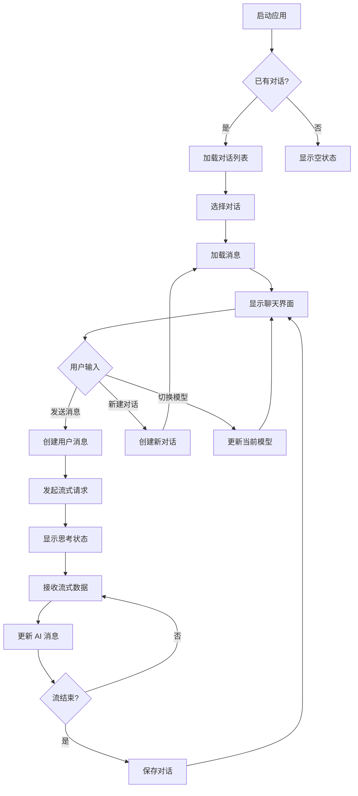
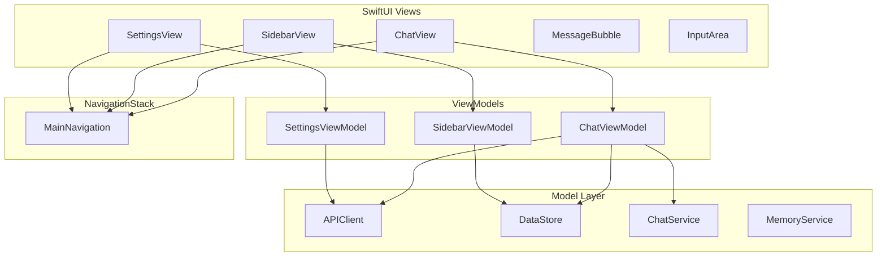
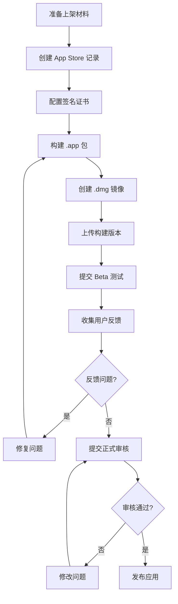
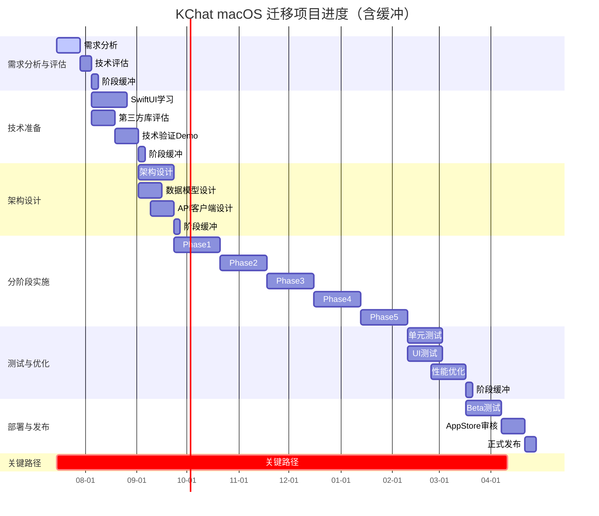

# KChat macOS SwiftUI 迁移计划

## 文档版本

| 版本 | 日期 | 作者 | 修改内容 |
|------|------|------|----------|
| 1.0 | 2026-07-15 | KChat Team | 初始版本 |

---

## 目录

1. [项目概述](#1-项目概述)
2. [需求分析与评估阶段](#2-需求分析与评估阶段)
3. [技术准备阶段](#3-技术准备阶段)
4. [架构设计阶段](#4-架构设计阶段)
5. [分阶段实施阶段](#5-分阶段实施阶段)
6. [测试与优化阶段](#6-测试与优化阶段)
7. [部署与发布阶段](#7-部署与发布阶段)
8. [风险评估与应对措施](#8-风险评估与应对措施)
9. [macOS 特有功能设计](#9-macos-特有功能设计)
10. [差距弥补任务](#10-差距弥补任务)
11. [附录 A：React → SwiftUI 概念映射](#附录-a-react--swiftui-概念映射)
12. [附录 B：依赖库替代方案](#附录-b-依赖库替代方案)
13. [附录 C：项目进度甘特图](#附录-c-项目进度甘特图)
14. [附录 D：资源需求](#附录-d-资源需求)

---

## 1. 项目概述

### 1.1 项目背景

KChat 是一个 ChatGPT 风格的聊天应用，支持多模型接入、RAG 记忆、Web 搜索和图像生成。当前前端基于 React 19 + TypeScript + TailwindCSS 构建，后端基于 Java Spring Boot。

### 1.2 迁移目标

将现有 Web 应用迁移至 **macOS native 应用**，基于 **SwiftUI 框架**，实现：

- 与 Web 版本一致的功能体验
- 更好的系统集成（通知、快捷键、文件系统访问）
- 更高的性能和响应速度
- 离线支持能力

### 1.3 迁移范围

| 范围 | 说明 |
|------|------|
| 前端框架 | React 19 → SwiftUI 5 (macOS 15+) |
| 后端服务 | 保持不变，通过 HTTP API 访问 |
| 数据存储 | localStorage → UserDefaults / Core Data |
| 第三方服务 | Cognee、AI 模型 API 保持不变 |

---

## 2. 需求分析与评估阶段

### 2.1 时间节点

| 开始时间 | 结束时间 | 持续时间 |
|----------|----------|----------|
| 第 1 周 | 第 2 周 | 2 周 |

### 2.2 责任人

| 角色 | 职责 |
|------|------|
| 技术负责人 | 整体技术评估与决策 |
| 架构师 | 架构设计与技术选型 |
| iOS 开发工程师 | SwiftUI 技术调研 |

### 2.3 交付物

| 交付物 | 描述 |
|--------|------|
| 功能模块清单 | 完整的功能模块列表及优先级 |
| 技术栈分析报告 | 现有技术栈与 SwiftUI 对比分析 |
| 用户交互流程文档 | 完整的用户交互流程图 |
| 迁移优先级矩阵 | 功能模块迁移优先级排序 |

### 2.4 质量验收标准

- [ ] 功能模块清单覆盖 100% 现有功能
- [ ] 技术栈分析完整，包含每个技术点的替代方案
- [ ] 用户交互流程文档包含所有关键路径
- [ ] 优先级矩阵经技术负责人批准

### 2.5 详细分析

#### 2.5.1 功能模块清单

| 模块 | 功能描述 | 优先级 | 复杂度 |
|------|----------|--------|--------|
| 聊天核心 | 消息发送/接收、流式输出、Markdown渲染 | P0 | 高 |
| 对话管理 | 新建/切换/删除对话、本地存储 | P0 | 中 |
| 模型选择 | 多模型支持、模型配置管理 | P0 | 中 |
| 侧边栏 | 对话列表、搜索、导航 | P1 | 中 |
| 用户设置 | 个人资料、主题切换、通知设置 | P1 | 中 |
| API密钥管理 | 创建/删除/查看 API 密钥 | P1 | 低 |
| 笔记/待办 | 笔记管理、待办事项 | P2 | 中 |
| 记忆系统 | RAG 记忆检索、Cognee 集成 | P2 | 高 |
| Web 搜索 | 联网搜索功能 | P2 | 中 |
| 图片生成 | AI 图像生成 | P2 | 中 |
| 高级动画 | ElectricBorder、ProfileCard 特效 | P3 | 高 |

#### 2.5.2 技术栈对比分析

| React 技术 | SwiftUI 替代方案 | 适配难度 | 备注 |
|------------|------------------|----------|------|
| React Context | @Environment / @ObservableObject | 中 | 需要重新设计状态管理 |
| useReducer | @ObservableObject + Combine | 中 | 需学习 Combine 框架 |
| useState | @State / @Binding | 低 | 概念相似 |
| useEffect | .onAppear / .onDisappear / Task | 低 | SwiftUI 生命周期 |
| CSS Variables | EnvironmentValues | 中 | 需要自定义环境值 |
| TailwindCSS | SwiftUI View Modifiers | 高 | 需要自定义 modifier |
| Framer Motion | SwiftUI .animation / .transition | 中 | 部分特效需重新实现 |
| react-virtuoso | LazyVStack / List | 低 | SwiftUI 原生支持 |
| react-markdown | swift-markdown / AttributedString | 中 | 需处理 Markdown 解析 |
| react-syntax-highlighter | Highlightr / Splash | 中 | 需要集成第三方库 |
| react-toastify | SwiftUI Overlay / Alert | 低 | 自定义实现 |
| SSE | URLSession + AsyncBytes | 高 | 需要手动解析 SSE |
| localStorage | UserDefaults / Core Data | 低 | 原生支持 |
| FileReader | Data(contentsOf:) | 低 | 原生支持 |

#### 2.5.3 用户交互流程



---

## 3. 技术准备阶段

### 3.1 时间节点

| 开始时间 | 结束时间 | 持续时间 |
|----------|----------|----------|
| 第 2 周 | 第 4 周 | 3 周 |

### 3.2 责任人

| 角色 | 职责 |
|------|------|
| iOS 开发工程师 | SwiftUI 学习与技术验证 |
| 架构师 | 第三方库评估与选型 |
| 技术负责人 | 开发环境配置 |

### 3.3 交付物

| 交付物 | 描述 |
|--------|------|
| 开发环境配置文档 | Xcode、macOS SDK 版本要求与配置步骤 |
| SwiftUI 学习笔记 | 核心概念与最佳实践文档 |
| 第三方库评估报告 | 替代方案对比与选型决策 |
| 技术验证 Demo | 关键技术点的 PoC 实现 |

### 3.4 质量验收标准

- [ ] Xcode 16 + macOS SDK 15 环境配置完成
- [ ] SwiftUI 学习笔记覆盖所有核心概念
- [ ] 第三方库选型经团队评审通过
- [ ] 技术验证 Demo 可正常运行

### 3.5 详细任务

#### 3.5.1 开发环境配置

| 项目 | 要求版本 | 备注 |
|------|----------|------|
| macOS | Sonoma 15.0+ | 开发与测试环境 |
| Xcode | 16.0+ | 最新稳定版 |
| Swift | 6.0+ | Swift 6 模式 |
| macOS SDK | 15.0+ | 目标部署版本 |

#### 3.5.2 SwiftUI 核心学习内容

| 学习模块 | 内容 | 优先级 |
|----------|------|--------|
| View 基础 | View、Modifier、Layout | P0 |
| 状态管理 | @State、@Binding、@ObservableObject | P0 |
| 数据流 | @Environment、@Published、Combine | P0 |
| 导航 | NavigationStack、TabView、Sidebar | P0 |
| 列表 | List、LazyVStack、ForEach | P0 |
| 动画 | .animation、.transition、withAnimation | P1 |
| 生命周期 | .onAppear、.onDisappear、Task | P1 |
| 异步编程 | async/await、URLSession | P0 |
| 数据持久化 | UserDefaults、Core Data | P1 |

#### 3.5.3 第三方库兼容性评估

| 功能 | React 库 | SwiftUI 替代方案 | 状态 |
|------|----------|------------------|------|
| Markdown 渲染 | react-markdown | swift-markdown (Apple) | 推荐 |
| 代码高亮 | react-syntax-highlighter | Splash (SPM) | 推荐 |
| Toast 通知 | react-toastify | 自定义 Overlay | 自研 |
| 图标 | lucide-react | SF Symbols | 原生 |
| 动画 | framer-motion | SwiftUI 原生动画 | 原生 |
| 虚拟列表 | react-virtuoso | LazyVStack | 原生 |

#### 3.5.4 技术验证 Demo

| Demo | 验证内容 | 预计时间 |
|------|----------|----------|
| SSE 流式接收 | URLSession + AsyncBytes 解析 SSE | 2 天 |
| Markdown 渲染 | swift-markdown 解析与渲染 | 2 天 |
| 代码高亮 | Splash 集成与主题适配 | 1 天 |
| 主题切换 | EnvironmentValues 实现主题系统 | 2 天 |
| 本地存储 | Core Data 数据模型设计 | 2 天 |

---

## 4. 架构设计阶段

### 4.1 时间节点

| 开始时间 | 结束时间 | 持续时间 |
|----------|----------|----------|
| 第 4 周 | 第 6 周 | 3 周 |

### 4.2 责任人

| 角色 | 职责 |
|------|------|
| 架构师 | 整体架构设计 |
| iOS 开发工程师 | 数据模型与组件设计 |
| 技术负责人 | 架构评审与批准 |

### 4.3 交付物

| 交付物 | 描述 |
|--------|------|
| 架构设计文档 | 完整的架构说明与组件关系图 |
| 数据模型设计 | Core Data 实体定义与关系 |
| 组件清单 | 所有 SwiftUI View 组件列表 |
| API 客户端设计 | 网络请求层设计 |
| 状态管理方案 | 全局状态与局部状态管理策略 |

### 4.4 质量验收标准

- [ ] 架构设计文档经技术负责人批准
- [ ] 数据模型覆盖所有业务实体
- [ ] 组件清单包含所有需要实现的 View
- [ ] API 客户端设计包含错误处理机制

### 4.5 详细设计

#### 4.5.1 架构模式

采用 **MVVM** 架构，使用 SwiftUI 原生导航：



#### 4.5.2 模块划分

```
KChat/
├── App/
│   ├── KChatApp.swift          # 应用入口
│   └── MainNavigation.swift    # 主导航配置
├── Data/                       # SwiftData 数据层
│   ├── Chat/
│   │   ├── Message.swift
│   │   └── Conversation.swift
│   ├── Model/
│   │   ├── Model.swift
│   │   └── ModelConfig.swift
│   ├── User/
│   │   ├── UserProfile.swift
│   │   └── APIKey.swift
│   ├── NoteTodo/
│   │   ├── Note.swift
│   │   └── Todo.swift
│   └── KChatContainer.swift    # SwiftData Container 配置
├── Services/                   # 业务服务层
│   ├── APIClient.swift         # HTTP 客户端
│   ├── ChatService.swift       # 聊天业务逻辑
│   ├── MemoryService.swift     # 记忆服务
│   ├── TokenService.swift      # Keychain 令牌管理
│   ├── ThemeService.swift      # 主题管理
│   └── FileUploadService.swift # 文件上传服务（支持分片）
├── ViewModels/                 # 视图模型
│   ├── ChatViewModel.swift
│   ├── SidebarViewModel.swift
│   ├── SettingsViewModel.swift
│   ├── NoteTodoViewModel.swift
│   └── ModelSettingsViewModel.swift
├── Views/                      # SwiftUI 视图
│   ├── Chat/
│   │   ├── ChatView.swift
│   │   ├── MessageBubble.swift
│   │   ├── MarkdownView.swift
│   │   ├── CodeBlock.swift
│   │   ├── InputArea.swift
│   │   └── TypingIndicator.swift
│   ├── Sidebar/
│   │   ├── SidebarView.swift
│   │   └── ConversationItem.swift
│   ├── Settings/
│   │   ├── SettingsView.swift
│   │   ├── ProfileSection.swift
│   │   ├── PreferencesSection.swift
│   │   ├── APIKeysSection.swift
│   │   └── ModelSettingsSection.swift
│   ├── NoteTodo/
│   │   ├── NoteTodoView.swift
│   │   ├── NoteList.swift
│   │   └── TodoList.swift
│   └── Common/
│       ├── ModalView.swift
│       ├── DrawerView.swift
│       ├── ToastView.swift
│       └── ErrorCard.swift
├── Utils/                      # 工具类
│   ├── SSEParser.swift         # SSE 解析器
│   ├── MarkdownRenderer.swift  # Markdown 渲染
│   ├── ChunkedUploader.swift   # 分片上传器
│   └── Extensions/
│       ├── View+Extensions.swift
│       ├── Color+Extensions.swift
│       └── KeyboardShortcuts.swift
├── Resources/                  # 资源文件
│   ├── Assets.xcassets
│   └── Fonts/
├── Config/                     # 配置文件
│   ├── Entitlements.plist      # App Sandbox 权限
│   └── Info.plist              # ATS 配置
└── Tests/                      # 测试
    ├── UnitTests/
    └── UITests/
```

#### 4.5.3 数据模型设计（SwiftData）

采用 **SwiftData**（macOS 14+）作为数据持久化方案，替代传统的 Core Data：

```swift
@Model
final class Conversation {
    @Attribute(.unique) var id: String
    var title: String
    var createdAt: Date
    var updatedAt: Date
    @Relationship(deleteRule: .cascade) var messages: [Message] = []
    
    init(id: String, title: String) {
        self.id = id
        self.title = title
        self.createdAt = Date()
        self.updatedAt = Date()
    }
}

@Model
final class Message {
    @Attribute(.unique) var id: String
    var content: String
    var type: MessageType // user | assistant
    var timestamp: Date
    var conversation: Conversation?
    
    init(id: String, content: String, type: MessageType) {
        self.id = id
        self.content = content
        self.type = type
        self.timestamp = Date()
    }
}

@Model
final class ModelConfig {
    @Attribute(.unique) var id: String
    var name: String
    var modelId: String
    var baseUrl: String
    var apiKey: String
    var type: ProviderType
    var category: ModelCategory
    var enabled: Bool
    
    init(id: String, name: String, modelId: String, baseUrl: String, 
         apiKey: String, type: ProviderType, category: ModelCategory) {
        self.id = id
        self.name = name
        self.modelId = modelId
        self.baseUrl = baseUrl
        self.apiKey = apiKey
        self.type = type
        self.category = category
        self.enabled = true
    }
}

@Model
final class Note {
    @Attribute(.unique) var id: String
    var title: String
    var content: String
    var category: String
    var tags: [String]
    var pinned: Bool
    var createdAt: Date
    var updatedAt: Date
    
    init(id: String, title: String, content: String) {
        self.id = id
        self.title = title
        self.content = content
        self.category = "default"
        self.tags = []
        self.pinned = false
        self.createdAt = Date()
        self.updatedAt = Date()
    }
}

@Model
final class Todo {
    @Attribute(.unique) var id: String
    var title: String
    var description: String
    var status: TodoStatus // pending | completed
    var priority: TodoPriority // high | medium | low
    var dueDate: Date?
    var category: String
    var createdAt: Date
    var completedAt: Date?
    
    init(id: String, title: String) {
        self.id = id
        self.title = title
        self.description = ""
        self.status = .pending
        self.priority = .medium
        self.category = "default"
        self.createdAt = Date()
    }
}
```

#### 4.5.4 SwiftData 容器配置

```swift
import SwiftData

struct KChatContainer {
    static func create() -> ModelContainer {
        let schema = Schema([
            Conversation.self,
            Message.self,
            ModelConfig.self,
            Note.self,
            Todo.self
        ])
        
        let config = ModelConfiguration(schema: schema, isStoredInMemoryOnly: false)
        
        do {
            return try ModelContainer(for: schema, configurations: config)
        } catch {
            fatalError("Failed to create ModelContainer: \(error)")
        }
    }
}
```

#### 4.5.4 API 客户端设计

```swift
struct APIClient {
    private let session: URLSession
    private let baseURL: URL
    private let token: String?
    
    // 核心方法
    func request<T: Decodable>(_ endpoint: Endpoint) async throws -> T
    func requestStream(_ endpoint: Endpoint) async throws -> AsyncThrowingStream<ChatCompletionChunk, Error>
    func uploadFile(_ url: URL, file: Data, fileName: String) async throws -> URL
    
    // 拦截器
    func addAuthToken(_ token: String)
    func clearAuthToken()
}
```

#### 4.5.5 状态管理方案

| 状态类型 | 管理方式 | 适用场景 |
|----------|----------|----------|
| 全局状态 | @ObservableObject + @EnvironmentObject | 主题、用户信息、当前模型 |
| 页面状态 | @ObservableObject + @StateObject | 聊天状态、对话列表 |
| 局部状态 | @State + @Binding | 表单输入、弹窗显隐 |

---

## 5. 分阶段实施阶段

### 5.1 阶段总览

| 阶段 | 时间 | 核心功能 | 交付物 |
|------|------|----------|--------|
| Phase 1 | 第 6-8 周 | 聊天核心功能 | 可发送/接收消息的聊天界面 |
| Phase 2 | 第 8-10 周 | 对话管理与侧边栏 | 完整的对话管理功能 |
| Phase 3 | 第 10-12 周 | 用户设置与主题 | 完整的设置模块 |
| Phase 4 | 第 12-14 周 | 笔记/待办与记忆 | 扩展功能模块 |
| Phase 5 | 第 14-16 周 | 高级动画与优化 | 精美的 UI 动画效果 |

### 5.2 Phase 1：聊天核心功能

#### 5.2.1 时间节点

| 开始时间 | 结束时间 | 持续时间 |
|----------|----------|----------|
| 第 6 周 | 第 8 周 | 3 周 |

#### 5.2.2 责任人

| 角色 | 职责 |
|------|------|
| iOS 开发工程师 | 聊天视图实现 |
| 架构师 | API 客户端指导 |

#### 5.2.3 交付物

| 交付物 | 描述 |
|--------|------|
| ChatView | 聊天主视图 |
| MessageBubble | 消息气泡组件 |
| InputArea | 输入区域组件 |
| APIClient | HTTP 客户端实现 |
| SSEParser | SSE 流式解析器 |
| MarkdownView | Markdown 渲染组件 |

#### 5.2.4 质量验收标准

- [ ] 可发送文本消息
- [ ] 可接收流式响应
- [ ] Markdown 内容正确渲染
- [ ] 代码块语法高亮
- [ ] 思考状态指示器显示

#### 5.2.5 实施任务

| 任务 | 描述 | 预计时间 |
|------|------|----------|
| 5.2.5.1 | 创建 APIClient 基础架构 | 2 天 |
| 5.2.5.2 | 实现 SSEParser 流式解析器 | 3 天 |
| 5.2.5.3 | 创建 ChatViewModel | 2 天 |
| 5.2.5.4 | 实现 ChatView 主界面 | 3 天 |
| 5.2.5.5 | 实现 MessageBubble 组件 | 2 天 |
| 5.2.5.6 | 实现 InputArea 组件 | 2 天 |
| 5.2.5.7 | 集成 swift-markdown 渲染 | 3 天 |
| 5.2.5.8 | 集成 Splash 代码高亮 | 2 天 |
| 5.2.5.9 | 实现 TypingIndicator | 1 天 |
| 5.2.5.10 | 联调测试 | 3 天 |

### 5.3 Phase 2：对话管理与侧边栏

#### 5.3.1 时间节点

| 开始时间 | 结束时间 | 持续时间 |
|----------|----------|----------|
| 第 8 周 | 第 10 周 | 3 周 |

#### 5.3.2 责任人

| 角色 | 职责 |
|------|------|
| iOS 开发工程师 | 侧边栏与对话管理实现 |
| 架构师 | Core Data 设计指导 |

#### 5.3.3 交付物

| 交付物 | 描述 |
|--------|------|
| SidebarView | 侧边栏视图 |
| ConversationItem | 对话项组件 |
| DataStore | Core Data 数据存储 |
| ConversationService | 对话业务逻辑 |

#### 5.3.4 质量验收标准

- [ ] 显示对话列表
- [ ] 支持新建对话
- [ ] 支持切换对话
- [ ] 支持删除对话
- [ ] 对话数据持久化

#### 5.3.5 实施任务

| 任务 | 描述 | 预计时间 |
|------|------|----------|
| 5.3.5.1 | 设计 Core Data 数据模型 | 2 天 |
| 5.3.5.2 | 实现 DataStore 服务 | 3 天 |
| 5.3.5.3 | 创建 SidebarViewModel | 2 天 |
| 5.3.5.4 | 实现 SidebarView | 3 天 |
| 5.3.5.5 | 实现 ConversationItem | 2 天 |
| 5.3.5.6 | 实现对话搜索功能 | 2 天 |
| 5.3.5.7 | 实现对话创建/删除 | 2 天 |
| 5.3.5.8 | 联调测试 | 3 天 |

### 5.4 Phase 3：用户设置与主题

#### 5.4.1 时间节点

| 开始时间 | 结束时间 | 持续时间 |
|----------|----------|----------|
| 第 10 周 | 第 12 周 | 3 周 |

#### 5.4.2 责任人

| 角色 | 职责 |
|------|------|
| iOS 开发工程师 | 设置界面与主题实现 |
| 架构师 | EnvironmentValues 设计指导 |

#### 5.4.3 交付物

| 交付物 | 描述 |
|--------|------|
| SettingsView | 设置主视图 |
| ThemeService | 主题管理服务 |
| ModelSettings | 模型配置管理 |
| APIKeysSection | API 密钥管理 |

#### 5.4.4 质量验收标准

- [ ] 支持深色/浅色/系统主题切换
- [ ] 支持模型配置管理
- [ ] 支持 API 密钥管理
- [ ] 设置数据持久化

#### 5.4.5 实施任务

| 任务 | 描述 | 预计时间 |
|------|------|----------|
| 5.4.5.1 | 设计主题系统 EnvironmentValues | 2 天 |
| 5.4.5.2 | 实现 ThemeService | 2 天 |
| 5.4.5.3 | 创建 SettingsViewModel | 2 天 |
| 5.4.5.4 | 实现 SettingsView | 3 天 |
| 5.4.5.5 | 实现 PreferencesSection | 2 天 |
| 5.4.5.6 | 实现 ModelSettingsSection | 3 天 |
| 5.4.5.7 | 实现 APIKeysSection | 2 天 |
| 5.4.5.8 | 联调测试 | 3 天 |

### 5.5 Phase 4：笔记/待办与记忆

#### 5.5.1 时间节点

| 开始时间 | 结束时间 | 持续时间 |
|----------|----------|----------|
| 第 12 周 | 第 14 周 | 3 周 |

#### 5.5.2 责任人

| 角色 | 职责 |
|------|------|
| iOS 开发工程师 | 笔记/待办与记忆功能实现 |
| 架构师 | Cognee 集成指导 |

#### 5.5.3 交付物

| 交付物 | 描述 |
|--------|------|
| NoteTodoView | 笔记/待办视图 |
| MemoryService | 记忆服务 |
| WebSearchService | Web 搜索服务 |

#### 5.5.4 质量验收标准

- [ ] 笔记创建/编辑/删除
- [ ] 待办创建/完成/删除
- [ ] 记忆检索功能
- [ ] Web 搜索功能

#### 5.5.5 实施任务

| 任务 | 描述 | 预计时间 |
|------|------|----------|
| 5.5.5.1 | 扩展 Core Data 模型（Note/Todo） | 2 天 |
| 5.5.5.2 | 创建 NoteTodoViewModel | 2 天 |
| 5.5.5.3 | 实现 NoteTodoView | 3 天 |
| 5.5.5.4 | 实现 NoteForm / TodoForm | 2 天 |
| 5.5.5.5 | 实现 MemoryService | 3 天 |
| 5.5.5.6 | 实现 WebSearchService | 2 天 |
| 5.5.5.7 | 集成记忆检索到聊天流程 | 2 天 |
| 5.5.5.8 | 联调测试 | 3 天 |

### 5.6 Phase 5：高级动画与优化

#### 5.6.1 时间节点

| 开始时间 | 结束时间 | 持续时间 |
|----------|----------|----------|
| 第 14 周 | 第 16 周 | 3 周 |

#### 5.6.2 责任人

| 角色 | 职责 |
|------|------|
| iOS 开发工程师 | 动画实现与性能优化 |
| 架构师 | 动画方案评审 |

#### 5.6.3 交付物

| 交付物 | 描述 |
|--------|------|
| 动画效果集 | 所有 UI 动画实现 |
| 性能优化报告 | 性能分析与优化建议 |
| 错误处理完善 | 全局错误处理机制 |

#### 5.6.4 质量验收标准

- [ ] 消息进入动画
- [ ] 侧边栏展开/折叠动画
- [ ] 主题切换过渡动画
- [ ] 页面切换动画
- [ ] 应用响应时间 < 100ms

#### 5.6.5 实施任务

| 任务 | 描述 | 预计时间 |
|------|------|----------|
| 5.6.5.1 | 实现消息进入动画 | 2 天 |
| 5.6.5.2 | 实现侧边栏动画 | 2 天 |
| 5.6.5.3 | 实现主题切换过渡 | 2 天 |
| 5.6.5.4 | 实现页面切换动画 | 2 天 |
| 5.6.5.5 | 性能分析与优化 | 3 天 |
| 5.6.5.6 | 完善错误处理机制 | 2 天 |
| 5.6.5.7 | UI 细节优化 | 3 天 |
| 5.6.5.8 | 全面测试 | 3 天 |

---

## 6. 测试与优化阶段

### 6.1 时间节点

| 开始时间 | 结束时间 | 持续时间 |
|----------|----------|----------|
| 第 16 周 | 第 18 周 | 3 周 |

### 6.2 责任人

| 角色 | 职责 |
|------|------|
| iOS 开发工程师 | 单元测试与 UI 测试 |
| QA 工程师 | 用户体验测试 |
| 技术负责人 | 性能分析与优化 |

### 6.3 交付物

| 交付物 | 描述 |
|--------|------|
| 测试用例文档 | 完整的测试用例清单 |
| 单元测试报告 | 单元测试覆盖率报告 |
| UI 测试报告 | UI 自动化测试结果 |
| 性能分析报告 | 性能指标与优化建议 |
| Bug 修复清单 | 所有发现的问题与修复状态 |

### 6.4 质量验收标准

- [ ] 单元测试覆盖率 ≥ 70%
- [ ] UI 测试通过率 ≥ 95%
- [ ] 应用启动时间 < 2 秒
- [ ] 内存使用稳定，无泄漏
- [ ] 所有严重 Bug 已修复

### 6.5 测试策略

#### 6.5.1 单元测试

| 测试模块 | 测试内容 | 覆盖范围 |
|----------|----------|----------|
| APIClient | 请求构建、响应解析、错误处理 | 100% |
| SSEParser | SSE 格式解析、流式数据处理 | 100% |
| DataStore | 数据增删改查、持久化 | 100% |
| ChatService | 消息构建、流式处理逻辑 | 80% |
| ThemeService | 主题切换、环境值更新 | 100% |

#### 6.5.2 UI 测试

| 测试场景 | 测试内容 |
|----------|----------|
| 聊天流程 | 发送消息、接收响应、Markdown 渲染 |
| 对话管理 | 新建对话、切换对话、删除对话 |
| 设置流程 | 主题切换、模型配置、API 密钥管理 |
| 笔记/待办 | 创建笔记、完成待办、分类管理 |

#### 6.5.3 性能测试

| 测试指标 | 目标值 | 测试方法 |
|----------|--------|----------|
| 启动时间 | < 2 秒 | Xcode Instruments |
| 内存峰值 | < 100MB | Xcode Memory Graph |
| CPU 使用率 | < 30% | Xcode Instruments |
| 消息渲染 | < 50ms/条 | 手动计时 |

---

## 7. 部署与发布阶段

### 7.1 时间节点

| 开始时间 | 结束时间 | 持续时间 |
|----------|----------|----------|
| 第 18 周 | 第 20 周 | 3 周 |

### 7.2 责任人

| 角色 | 职责 |
|------|------|
| 产品经理 | App Store 上架材料准备 |
| iOS 开发工程师 | 构建与打包 |
| QA 工程师 | Beta 测试管理 |
| 技术负责人 | 发布审批 |

### 7.3 交付物

| 交付物 | 描述 |
|--------|------|
| App Store 上架材料 | 应用截图、描述、关键词 |
| 构建版本 | 正式发布的 `.app` 包和 `.dmg` 镜像 |
| Beta 测试报告 | TestFlight 测试结果 |
| 用户反馈汇总 | Beta 用户反馈分析 |
| 发布说明 | 版本更新日志 |
| 签名证书 | Apple Developer 证书和配置文件 |

### 7.4 质量验收标准

- [ ] App Store 审核通过
- [ ] Beta 测试无严重 Bug
- [ ] 所有已知问题已处理
- [ ] 发布说明完整准确
- [ ] 应用签名验证通过

### 7.5 发布流程



### 7.6 上架材料清单

| 材料 | 要求 |
|------|------|
| 应用名称 | KChat |
| 应用描述 | ChatGPT 风格的 AI 聊天应用，支持多模型、RAG 记忆、Web 搜索 |
| 关键词 | AI, Chatbot, GPT, ChatGPT, 聊天, 人工智能 |
| 图标 | 1024x1024 PNG |
| 截图 | macOS 桌面截图（1280x800 或更高） |
| 隐私政策 | 包含数据收集说明 |
| 版权信息 | KChat Team |
| 技术支持 URL | 应用支持页面 |

### 7.7 macOS 特有配置

#### 7.7.1 App Sandbox 权限

| 权限 | 说明 | Entitlement Key |
|------|------|-----------------|
| 网络访问 | 访问后端 API 和 Cognee 服务 | `com.apple.security.network.client` |
| 文件读写 | 文件上传/下载功能 | `com.apple.security.files.user-selected.read-write` |
| Keychain 访问 | 存储 API 密钥和令牌 | `com.apple.security.application-groups` |

#### 7.7.2 App Transport Security (ATS)

需要在 `Info.plist` 中配置 ATS 例外以支持 localhost 服务：

```xml
<key>NSAppTransportSecurity</key>
<dict>
    <key>NSAllowsLocalNetworking</key>
    <true/>
    <key>NSExceptionDomains</key>
    <dict>
        <key>localhost</key>
        <dict>
            <key>NSExceptionAllowsInsecureHTTPLoads</key>
            <true/>
            <key>NSIncludesSubdomains</key>
            <true/>
        </dict>
    </dict>
</dict>
```

---

## 8. 风险评估与应对措施

### 8.1 技术风险

| 风险 | 概率 | 影响 | 应对措施 |
|------|------|------|----------|
| SSE 流式解析复杂 | 高 | 高 | 提前完成技术验证 Demo，封装 SSEParser |
| Markdown 渲染效果不一致 | 中 | 中 | 使用 Apple 官方 swift-markdown 库 |
| SwiftData 数据迁移 | 中 | 中 | 设计合理的 Schema 版本管理，使用 @Attribute(.unique) 确保数据一致性 |
| 动画效果无法完全还原 | 中 | 低 | 优先保证核心功能，复杂动画（ElectricBorder、ProfileCard 3D tilt）使用 CanvasView/Metal 重实现或优雅降级 |
| Keychain 集成复杂度 | 中 | 中 | 使用 Security.framework 封装 TokenService，参考 Apple 官方示例 |
| App Sandbox 权限配置 | 中 | 中 | 提前配置 Entitlements，确保网络、文件、Keychain 权限正确 |

### 8.2 进度风险

| 风险 | 概率 | 影响 | 应对措施 |
|------|------|------|----------|
| SwiftUI 学习曲线 | 中 | 中 | 提前安排学习时间，准备学习资料，安排技术负责人指导 |
| 第三方库兼容性问题 | 中 | 中 | 提前评估替代方案，准备备选方案 |
| API 接口变更 | 低 | 中 | 与后端团队保持沟通，制定接口规范 |
| 测试发现大量问题 | 中 | 高 | 每个阶段预留测试时间，及时修复 |
| 20 周时间线偏紧 | 中 | 高 | 每个阶段预留 20% 缓冲时间，调整甘特图日期 |

### 8.3 资源风险

| 风险 | 概率 | 影响 | 应对措施 |
|------|------|------|----------|
| 开发人员经验不足 | 中 | 高 | 安排技术负责人指导，代码审查，结对编程 |
| 设备测试不足 | 中 | 中 | 利用 Xcode 模拟器 + TestFlight，申请 macOS 测试设备 |
| 时间估算偏差 | 中 | 中 | 每个阶段预留 20% 缓冲时间，定期进度检查 |

---

## 9. macOS 特有功能设计

### 9.1 功能清单

| 功能 | 描述 | 优先级 | 实现方式 |
|------|------|--------|----------|
| NSToolbar | macOS 顶部工具栏，包含快捷操作 | P1 | NSToolbar + SwiftUI ToolbarItem |
| 键盘快捷键 | Cmd+N 新建对话、Cmd+K 搜索等 | P1 | .keyboardShortcut + CommandGroup |
| 拖放支持 | 文件拖放到输入区域直接上传 | P1 | .onDrop + NSItemProvider |
| Keychain 存储 | API 密钥和令牌安全存储 | P0 | Security.framework |
| 菜单集成 | 应用菜单和 Dock 菜单 | P2 | NSMenu + AppDelegate |
| 通知中心 | macOS 通知推送 | P2 | UserNotifications.framework |
| 深色模式 | 跟随系统深色模式自动切换 | P1 | EnvironmentValues + prefersColorScheme |

### 9.2 NSToolbar 设计

```swift
struct MainToolbar: ToolbarContent {
    var body: some ToolbarContent {
        ToolbarItem(placement: .navigation) {
            Button(action: { /* 新建对话 */ }) {
                Label("新建对话", systemImage: "plus")
            }
            .keyboardShortcut("N", modifiers: .command)
        }
        
        ToolbarItem(placement: .primaryAction) {
            Button(action: { /* 设置 */ }) {
                Label("设置", systemImage: "gear")
            }
            .keyboardShortcut(",", modifiers: .command)
        }
        
        ToolbarItem(placement: .status) {
            ConnectionStatusView()
        }
    }
}
```

### 9.3 键盘快捷键设计

| 快捷键 | 功能 | 实现方式 |
|--------|------|----------|
| Cmd+N | 新建对话 | .keyboardShortcut("N", modifiers: .command) |
| Cmd+K | 打开搜索 | .keyboardShortcut("K", modifiers: .command) |
| Cmd+, | 打开设置 | .keyboardShortcut(",", modifiers: .command) |
| Cmd+D | 删除当前对话 | .keyboardShortcut("D", modifiers: .command) |
| Cmd+Shift+M | 切换模型 | .keyboardShortcut("M", modifiers: [.command, .shift]) |
| Esc | 关闭弹窗/面板 | 系统默认 |

### 9.4 Keychain 令牌管理

```swift
import Security

class TokenService {
    private let service = "com.kchat.token"
    
    func saveToken(_ token: String) throws {
        let query: [CFString: Any] = [
            kSecClass: kSecClassGenericPassword,
            kSecAttrService: service,
            kSecAttrAccount: "auth_token",
            kSecValueData: token.data(using: .utf8)!
        ]
        
        SecItemDelete(query as CFDictionary)
        let status = SecItemAdd(query as CFDictionary, nil)
        guard status == errSecSuccess else {
            throw TokenError.saveFailed(status: status)
        }
    }
    
    func getToken() -> String? {
        let query: [CFString: Any] = [
            kSecClass: kSecClassGenericPassword,
            kSecAttrService: service,
            kSecAttrAccount: "auth_token",
            kSecReturnData: true,
            kSecMatchLimit: kSecMatchLimitOne
        ]
        
        var data: CFTypeRef?
        let status = SecItemCopyMatching(query as CFDictionary, &data)
        
        guard status == errSecSuccess, let tokenData = data as? Data else {
            return nil
        }
        
        return String(data: tokenData, encoding: .utf8)
    }
    
    func deleteToken() throws {
        let query: [CFString: Any] = [
            kSecClass: kSecClassGenericPassword,
            kSecAttrService: service,
            kSecAttrAccount: "auth_token"
        ]
        
        let status = SecItemDelete(query as CFDictionary)
        guard status == errSecSuccess || status == errSecItemNotFound else {
            throw TokenError.deleteFailed(status: status)
        }
    }
}
```

---

## 10. 差距弥补任务

基于前期技术分析，以下是 Web 版本中缺失或需要增强的功能：

### 10.1 认证流程增强

| 任务 | 描述 | 预计时间 | 优先级 |
|------|------|----------|--------|
| 10.1.1 | 实现 Keychain 令牌存储 | 2 天 | P0 |
| 10.1.2 | 实现登录/登出 UI 流程 | 3 天 | P1 |
| 10.1.3 | 实现令牌过期自动刷新 | 2 天 | P1 |

### 10.2 文件上传增强

| 任务 | 描述 | 预计时间 | 优先级 |
|------|------|----------|--------|
| 10.2.1 | 实现分片上传器 ChunkedUploader | 3 天 | P1 |
| 10.2.2 | 实现上传进度显示 | 2 天 | P1 |
| 10.2.3 | 实现断点续传功能 | 3 天 | P2 |

### 10.3 复杂动画重实现

| 任务 | 描述 | 预计时间 | 优先级 |
|------|------|----------|--------|
| 10.3.1 | ElectricBorder Canvas 动画重实现 | 5 天 | P3 |
| 10.3.2 | ProfileCard 3D 倾斜效果重实现 | 3 天 | P3 |
| 10.3.3 | 其他 CSS 关键帧动画迁移 | 3 天 | P2 |

---

## 附录 A：React → SwiftUI 概念映射

| React 概念 | SwiftUI 概念 | 说明 |
|------------|--------------|------|
| JSX | SwiftUI DSL | 声明式 UI 语法 |
| Component | View | 可复用的 UI 单元 |
| Props | Parameters | 视图参数传递 |
| useState | @State | 局部状态管理 |
| useEffect | .onAppear / .onDisappear | 生命周期钩子 |
| useContext | @Environment | 全局状态访问 |
| useReducer | @ObservableObject + Combine | 复杂状态管理 |
| useMemo / useCallback | .memo / .id | 性能优化 |
| Context Provider | @EnvironmentObject | 全局状态注入 |
| CSS Class | View Modifier | 样式应用 |
| CSS Variables | EnvironmentValues | 主题变量 |
| Flexbox | HStack / VStack / ZStack | 布局容器 |
| Grid | LazyVGrid / LazyHGrid | 网格布局 |
| List | List / LazyVStack | 列表组件 |
| Router | NavigationStack | 导航管理 |
| Modal | .sheet / .fullScreenCover | 模态框 |
| Animation | .animation / .transition | 动画系统 |
| SSE | URLSession + AsyncBytes | 流式数据 |

---

## 附录 B：依赖库替代方案

| React 依赖 | SwiftUI 替代方案 | 类型 | 备注 |
|------------|------------------|------|------|
| react-markdown | swift-markdown | Apple 官方 | 内置 Markdown 解析 |
| react-syntax-highlighter | Splash | SPM 库 | 语法高亮 |
| lucide-react | SF Symbols | 系统内置 | Apple 图标库 |
| framer-motion | SwiftUI Animations | 系统内置 | 原生动画支持 |
| react-virtuoso | LazyVStack | 系统内置 | 懒加载列表 |
| react-toastify | Custom Overlay | 自定义 | 简单实现 |
| react-modal | .sheet / .fullScreenCover | 系统内置 | 模态框 |
| tailwindcss | View Modifiers | 自定义 | 需要封装 |
| remark-gfm | swift-markdown | Apple 官方 | 支持 GFM |

---

## 附录 C：项目进度甘特图（含 20% 缓冲）



---

## 附录 D：资源需求

### D.1 人力需求

| 角色 | 人数 | 参与阶段 |
|------|------|----------|
| 技术负责人 | 1 | 全程 |
| 架构师 | 1 | 阶段 1-4 |
| iOS 开发工程师 | 2 | 阶段 2-6 |
| QA 工程师 | 1 | 阶段 5-6 |
| 产品经理 | 1 | 阶段 1, 6 |

### D.2 设备需求

| 设备 | 数量 | 用途 |
|------|------|------|
| MacBook Pro (M3) | 3 | 开发环境 |
| macOS 测试设备 | 2 | 真机测试 |
| iPhone/iPad | 2 | 兼容测试 |

### D.3 工具需求

| 工具 | 版本 | 用途 |
|------|------|------|
| Xcode | 16.0+ | IDE |
| Git | 2.40+ | 版本控制 |
| SwiftLint | 0.54+ | 代码检查 |
| Fastlane | 2.220+ | 自动化构建 |
