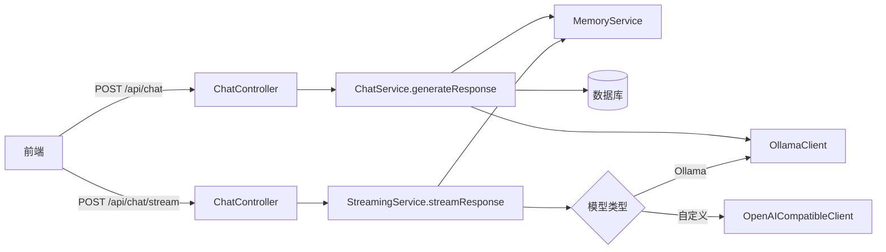

# KChat 后端技术债务分析报告

## 文档信息

| 项目 | 内容 |
|------|------|
| 项目名称 | KChat Backend |
| 分析日期 | 2026-05-27 |
| 分析范围 | 后端 Java 代码 |
| 综合评分 | 5.1/10 |

---

## 目录

1. [项目结构分析](#1-项目结构分析)
2. [调用链分析](#2-调用链分析)
3. [AI架构专项分析](#3-AI架构专项分析)
4. [高风险问题清单](#4-高风险问题清单)
5. [技术债务优先级分类](#5-技术债务优先级分类)
6. [修复方案与任务清单](#6-修复方案与任务清单)
7. [代码优化建议](#7-代码优化建议)

---

## 1. 项目结构分析

### 1.1 当前结构

```
backend/src/main/java/com/example/app/
├── client/           # 外部AI模型客户端
├── config/           # Spring配置类
├── controller/       # REST API控制层
├── dto/              # 数据传输对象
├── entity/           # JPA实体
├── exception/        # 异常处理
├── memory/           # 记忆管理
├── repository/       # 数据访问层
└── service/          # 业务逻辑层
```

### 1.2 结构问题

| 问题类型 | 描述 | 影响 |
|----------|------|------|
| **Controller过厚** | `ChatController`直接注入Repository进行数据库操作 | 违反分层原则，难以单元测试 |
| **Service职责不清** | `ChatService`与`StreamingService`存在重复逻辑 | 维护成本高，易产生不一致 |
| **Memory层单薄** | `LongTermMemory`为空实现 | 无法支持长期对话记忆 |

---

## 2. 调用链分析

### 2.1 核心调用路径



### 2.2 模块耦合矩阵

| 模块 | ChatController | ChatService | StreamingService | MemoryService |
|------|----------------|-------------|------------------|---------------|
| **依赖数量** | 6 | 4 | 6 | 2 |
| **耦合程度** | 高 | 中 | 高 | 低 |

---

## 3. AI架构专项分析

### 3.1 评估结果

| 检查项 | 现状 | 状态 |
|--------|------|------|
| 全局单例Memory | `ConcurrentHashMap`隔离 | ✅ 正确 |
| 会话隔离 | `conversationId`作为key | ✅ 已实现 |
| Prompt管理 | 硬编码在Client层 | ❌ 缺失 |
| 模型切换 | 通过参数支持 | ✅ 已实现 |
| 长期记忆 | `LongTermMemory`空实现 | ⚠️ 待完善 |
| RAG支持 | 无相关实现 | ❌ 缺失 |
| 硬编码模型 | 部分存在 | ⚠️ 问题 |
| 大方法 | `streamResponse`约110行 | ⚠️ 问题 |

---

## 4. 高风险问题清单

### 4.1 严重问题（P0）

| 序号 | 问题 | 位置 | 风险描述 |
|------|------|------|----------|
| 1 | 线程池无上限 | `StreamingService`第41行 | 高并发下可能OOM |
| 2 | JSON手动拼接 | `OllamaClient`第80-81行 | 存在注入风险 |
| 3 | API密钥明文存储 | `ModelConfig.java` | 敏感信息泄露 |
| 4 | 模型实例重复创建 | `OllamaClient.generate` | 严重性能问题 |

### 4.2 重要问题（P1）

| 序号 | 问题 | 位置 | 风险描述 |
|------|------|------|----------|
| 5 | Controller直接访问Repository | `ChatController` | 违反分层原则 |
| 6 | LongTermMemory空实现 | `LongTermMemory.java` | 无法支持长期记忆 |
| 7 | 重复代码 | `ChatService`与`StreamingService` | 维护成本高 |
| 8 | 大方法 | `StreamingService.streamResponse` | 可读性差 |

### 4.3 改进问题（P2）

| 序号 | 问题 | 位置 | 风险描述 |
|------|------|------|----------|
| 9 | 缺少RAG支持 | 全局 | 无法利用外部知识库 |
| 10 | Prompt散落 | Client层 | 难以管理优化 |
| 11 | 缺少监控 | 全局 | 无法感知系统状态 |
| 12 | 日志不足 | 部分模块 | 问题定位困难 |

---

## 5. 技术债务优先级分类

### P0 - 紧急修复（立即执行）

| 问题 | 修复成本 | 预期收益 | 负责人 |
|------|----------|----------|--------|
| 线程池无上限 | 低 | 高 | 架构师 |
| JSON注入风险 | 低 | 高 | 开发 |
| API密钥加密 | 中 | 高 | 安全工程师 |
| 模型实例缓存 | 低 | 高 | 开发 |

### P1 - 重要优化（1-2周内）

| 问题 | 修复成本 | 预期收益 | 负责人 |
|------|----------|----------|--------|
| Controller分层重构 | 中 | 中 | 架构师 |
| LongTermMemory实现 | 高 | 高 | 开发 |
| 代码去重 | 低 | 中 | 开发 |
| 大方法拆分 | 中 | 中 | 开发 |

### P2 - 改进建议（1-2月内）

| 问题 | 修复成本 | 预期收益 | 负责人 |
|------|----------|----------|--------|
| RAG支持 | 高 | 高 | 架构师 |
| Prompt管理 | 中 | 中 | 开发 |
| 监控集成 | 低 | 中 | DevOps |
| 日志完善 | 低 | 中 | 开发 |

---

## 6. 修复方案与任务清单

### 6.1 P0 紧急修复任务

#### 任务1：修复线程池资源耗尽风险

**问题位置**：`StreamingService.java`第41行

**现状代码**：
```java
private final ExecutorService executorService = Executors.newCachedThreadPool();
```

**修复方案**：
```java
@Configuration
public class AsyncConfig {
    @Bean
    public ExecutorService streamingExecutorService() {
        return new ThreadPoolExecutor(
            2,                              // corePoolSize
            10,                             // maximumPoolSize
            60L, TimeUnit.SECONDS,          // keepAliveTime
            new LinkedBlockingQueue<>(100), // workQueue
            new ThreadFactoryBuilder()
                .setNameFormat("streaming-%d")
                .build(),
            new ThreadPoolExecutor.CallerRunsPolicy() // 拒绝策略
        );
    }
}
```

**任务清单**：
- 创建`AsyncConfig.java`配置类
- 修改`StreamingService`注入线程池Bean
- 添加优雅关闭钩子

---

#### 任务2：修复JSON注入风险

**问题位置**：`OllamaClient.java`第80-81行、第149-163行

**现状代码**：
```java
String jsonInput = "{\"model\": \"" + targetModel + "\", \"prompt\": \""
        + escapeJson(promptBuilder.toString()) + "\", \"stream\": true}";
```

**修复方案**：
```java
ObjectNode requestBody = objectMapper.createObjectNode();
requestBody.put("model", targetModel);
requestBody.put("prompt", promptBuilder.toString());
requestBody.put("stream", true);

if (!base64Images.isEmpty()) {
    ArrayNode imagesArray = objectMapper.createArrayNode();
    base64Images.forEach(imagesArray::add);
    requestBody.set("images", imagesArray);
}

connection.getOutputStream().write(objectMapper.writeValueAsBytes(requestBody));
```

**任务清单**：
- 修改`streamGenerate`方法使用ObjectMapper构建JSON
- 修改`streamGenerateWithImages`方法使用ObjectMapper构建JSON
- 删除`escapeJson`方法（不再需要）

---

#### 任务3：API密钥加密存储

**问题位置**：`ModelConfig.java`

**修复方案**：
```java
@Entity
@Table(name = "model_configs")
public class ModelConfig {
    // ... 其他字段
    
    @Column(nullable = false)
    @Convert(converter = EncryptedStringConverter.class)
    private String apiKey;
    
    // ... getter/setter
}
```

**任务清单**：
- 创建`EncryptedStringConverter`加密转换器
- 配置加密密钥（通过环境变量注入）
- 数据库迁移脚本

---

#### 任务4：模型实例缓存

**问题位置**：`OllamaClient.java`第39-44行

**现状代码**：
```java
dev.langchain4j.model.ollama.OllamaChatModel modelInstance = dev.langchain4j.model.ollama.OllamaChatModel
        .builder()
        .baseUrl(ollamaConfig.getBaseUrl())
        .modelName(targetModel)
        .build();
```

**修复方案**：
```java
@Component
public class OllamaClient {
    private final Map<String, ChatLanguageModel> modelCache = new ConcurrentHashMap<>();
    
    public String generate(List<ChatMessage> messages, String model) {
        String targetModel = (model != null && !model.isBlank()) ? model : ollamaConfig.getDefaultModel();
        ChatLanguageModel modelInstance = modelCache.computeIfAbsent(targetModel, 
            key -> OllamaChatModel.builder()
                .baseUrl(ollamaConfig.getBaseUrl())
                .modelName(key)
                .build());
        // ...
    }
}
```

**任务清单**：
- 在`OllamaClient`中添加模型缓存
- 添加缓存清理机制
- 添加模型配置变更监听

---

### 6.2 P1 重要优化任务

#### 任务5：Controller分层重构

**问题位置**：`ChatController.java`

**现状问题**：直接注入Repository

**修复方案**：
```java
@RestController
@RequestMapping("/api")
public class ChatController {
    private final ChatService chatService;
    private final StreamingService streamingService;
    private final ModelConfigService modelConfigService;
    
    // 删除Repository注入
    
    @GetMapping("/models")
    public ResponseEntity<List<String>> listModels() {
        return ResponseEntity.ok(modelConfigService.listAvailableModels());
    }
}
```

**任务清单**：
- 创建`ConversationService`封装Repository操作
- 修改`ChatController`只依赖Service层
- 更新相关测试

---

#### 任务6：LongTermMemory实现

**问题位置**：`LongTermMemory.java`

**修复方案**：
```java
@Component
public class LongTermMemory {
    private final EmbeddingModel embeddingModel;
    private final VectorStore vectorStore;
    
    public void store(String conversationId, String content) {
        Embedding embedding = embeddingModel.embed(content).content();
        vectorStore.add(VectorStoreRecord.from(conversationId, embedding, content));
    }
    
    public List<String> retrieve(String query, int limit) {
        Embedding queryEmbedding = embeddingModel.embed(query).content();
        List<VectorStoreRecord> records = vectorStore.similaritySearch(queryEmbedding, limit);
        return records.stream()
            .map(VectorStoreRecord::content)
            .collect(Collectors.toList());
    }
}
```

**任务清单**：
- 添加向量数据库依赖（如Chroma、Pinecone）
- 实现`LongTermMemory`核心方法
- 集成到`MemoryService`

---

#### 任务7：代码去重

**问题位置**：`ChatService.java`与`StreamingService.java`

**重复内容**：
- `saveUserMessage`方法
- `saveAiMessage`方法
- JSON序列化逻辑

**修复方案**：
```java
@Service
public class MessagePersistenceService {
    private final MessageRepository messageRepository;
    private final ObjectMapper objectMapper;
    
    @Transactional
    public void saveUserMessage(String conversationId, String content, List<String> imageUrls) {
        // 统一实现
    }
    
    @Transactional
    public void saveAiMessage(String conversationId, String content) {
        // 统一实现
    }
}
```

**任务清单**：
- 创建`MessagePersistenceService`
- 修改`ChatService`和`StreamingService`使用新Service
- 删除重复代码

---

#### 任务8：大方法拆分

**问题位置**：`StreamingService.streamResponse`约110行

**拆分方案**：
| 方法 | 职责 |
|------|------|
| `streamResponse` | 主入口，初始化Emitter |
| `createOrGetConversation` | 会话创建/获取 |
| `buildMessageContext` | 构建消息上下文 |
| `selectModelClient` | 选择模型客户端 |
| `handleStreamingResponse` | 处理流式响应 |
| `persistMessages` | 持久化消息 |

**任务清单**：
- 将`streamResponse`拆分为5-6个子方法
- 每个方法单一职责
- 更新测试用例

---

### 6.3 P2 改进建议任务

#### 任务9：RAG支持

**方案**：
```java
@Service
public class RagService {
    private final VectorStore vectorStore;
    private final EmbeddingModel embeddingModel;
    
    public List<String> retrieveRelevantDocuments(String query, int topK) {
        Embedding queryEmbedding = embeddingModel.embed(query).content();
        return vectorStore.similaritySearch(queryEmbedding, topK)
            .stream()
            .map(VectorStoreRecord::content)
            .collect(Collectors.toList());
    }
    
    public void ingestDocument(String content, String metadata) {
        Embedding embedding = embeddingModel.embed(content).content();
        vectorStore.add(VectorStoreRecord.from(metadata, embedding, content));
    }
}
```

**任务清单**：
- 添加LangChain4j RAG依赖
- 实现`RagService`
- 集成到`ChatService`

---

#### 任务10：Prompt管理

**方案**：
```java
@Entity
public class PromptTemplate {
    @Id
    @GeneratedValue(strategy = GenerationType.IDENTITY)
    private Long id;
    
    @Column(nullable = false, unique = true)
    private String name;
    
    @Column(columnDefinition = "TEXT", nullable = false)
    private String template;
    
    @Column(nullable = false)
    private String modelType;
}

@Service
public class PromptService {
    private final PromptTemplateRepository repository;
    
    public String renderTemplate(String templateName, Map<String, Object> variables) {
        PromptTemplate template = repository.findByName(templateName)
            .orElseThrow(() -> new IllegalArgumentException("Template not found: " + templateName));
        return StrSubstitutor.replace(template.getTemplate(), variables);
    }
}
```

**任务清单**：
- 创建`PromptTemplate`实体
- 创建`PromptService`
- 修改Client层使用PromptService

---

## 7. 代码优化建议

### 7.1 最佳实践清单

| 类别 | 建议 |
|------|------|
| **异常处理** | 使用`@ControllerAdvice`统一处理，避免try-catch吞没异常 |
| **日志** | 在关键路径添加`log.info()`，异常处使用`log.error()`并附带堆栈 |
| **事务** | 明确事务边界，避免`@Transactional`滥用 |
| **依赖注入** | 使用构造器注入，避免字段注入 |
| **资源管理** | 使用try-with-resources管理流和连接 |
| **配置** | 敏感配置通过环境变量注入，使用`@ConfigurationProperties` |

### 7.2 代码质量检查清单

- [ ] 所有public方法有单元测试覆盖
- [ ] 异常处理完整，无静默吞没
- [ ] 日志级别合理，关键路径有日志
- [ ] 无魔法数字，使用常量定义
- [ ] 方法长度不超过50行
- [ ] 类职责单一，不超过200行

---

## 附录：项目评分明细

| 维度 | 评分 | 说明 |
|------|------|------|
| 项目结构 | 6/10 | 基本分层清晰 |
| 可维护性 | 5/10 | 存在重复代码 |
| AI架构 | 4/10 | 长期记忆空实现 |
| 扩展性 | 5/10 | 耦合度较高 |
| 异常处理 | 5/10 | 部分异常被吞没 |
| 日志体系 | 6/10 | 基本日志存在 |
| 数据库设计 | 7/10 | 实体设计合理 |
| 模块边界 | 4/10 | 边界模糊 |

---

**文档版本**: v1.0  
**生成日期**: 2026-05-27  
**作者**: 架构师团队
