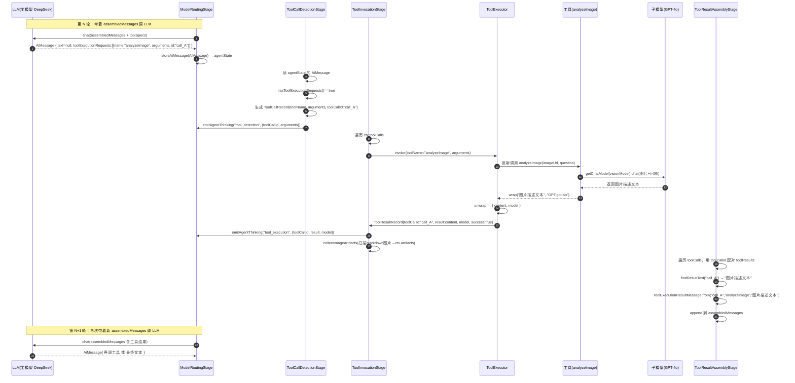

# KChat Agent 架构与多模态工具系统 — 技术总结

> 本文档基于 KChat 后端开发过程中的系列讨论整理而成，按逻辑结构重新组织，
> 系统性总结 Agent 模式工作原理、多模态图片工具演进、信息分流机制及核心概念。
>
> 适用读者：参与 KChat 后端（`backend/src/main/java/com/example/app`）开发与维护的工程师。

---

## 目录

1. [Agent 模式工作原理](#一agent-模式工作原理)
2. [信息分流：哪些给模型，哪些给用户](#二信息分流哪些给模型哪些给用户)
3. [多模态图片工具的演进](#三多模态图片工具的演进)
4. [核心概念解析](#四核心概念解析)
5. [完整时序图](#五完整时序图)
6. [工具箱自定义模型](#六工具箱自定义模型)
7. [已修复的关键问题](#七已修复的关键问题)
8. [遗留建议与注意事项](#八遗留建议与注意事项)

---

## 一、Agent 模式工作原理

Agent 模式本质是一个 **ReAct（Reason + Act）循环**：规划 → 执行 → 观察 → 再规划，
由 `ContextPipelineExecutor.executeWithAgentLoop` 驱动，直到 LLM 不再调用工具或达到最大迭代次数。

### 1.1 循环骨架

```
第一轮: PREPROCESS → ASSEMBLY → EXECUTION → AGENT
                   （初始化上下文 + 首次调 LLM + 检测/执行工具）

while (有工具调用 && 未达 maxIterations):
    清空上一轮 toolCalls
    下一轮: EXECUTION → AGENT   ← 带着工具结果再次调 LLM

终止条件（满足其一）:
  1. LLM 本轮不再发起工具调用（返回纯文本）→ 循环结束
  2. currentIteration + 1 >= maxAgentIterations → 强制退出（记 warn）
  3. 关键阶段抛不可恢复异常 → 中断流水线
```

### 1.2 每轮 AGENT 流水线（按 order 递增）

| order | 阶段 | 职责 |
|-------|------|------|
| 480 | `ToolDefinitionStage` | 把全部工具规格注入 `agentState` |
| 500 | `ModelRoutingStage` | 调 LLM，把 `AiMessage`（工具调用请求或文本）存入 `agentState` |
| 610 | `ToolCallDetectionStage` | 解析 `AiMessage` 的工具调用 → `ctx.toolCalls` |
| 650 | `ToolInvocationStage` | 逐一执行工具 → `ctx.toolResults` |
| 660 | `ToolResultAssemblyStage` | 把 `AiMessage` + 工具结果回填进 `assembledMessages` |
| 680 | `AgentLoopControlStage` | 记录迭代状态 |

### 1.3 核心结论：复杂需求由谁分解？

**分解不是后端写死的，而是 LLM 通过 function calling 自主决策。**

- 后端只负责：提供工具清单、执行工具、回填结果、控制循环轮数。
- LLM 自己决定：调哪个工具、什么顺序、传什么参数、信息是否足够、何时收尾。
- **Tool 只是"无脑的执行器"**，拿到参数执行后原样返回结果文本，**不做任何决策**；
  "继续调用还是返回结果"完全由 LLM 下一轮输出 `toolExecutionRequests` 还是 `text` 决定。

```java
// ToolCallDetectionStage —— 唯一的分流信号
if (!aiMessage.hasToolExecutionRequests()) {
    return;                        // → 当最终答案，收尾
}
// 否则 → 提取工具调用，继续循环
```

---

## 二、信息分流：哪些给模型，哪些给用户

Context 里存在**多个相互隔离的信息通道**，这是"模型看到什么 / 用户看到什么"的分流基础。

| 通道 | 流向 | 内容 |
|------|------|------|
| `assembledMessages` | **→ 大模型** | 对话历史 + 工具调用请求(AiMessage) + 工具结果(ToolExecutionResultMessage) |
| `agentState` | **内部中转** | AiMessage、toolSpecs 等模型调用过程状态 |
| `ctx.llmResponse` | **→ 用户（最终文本）** | 每轮覆盖，最终值 = 最后一轮无工具调用的文本回复 |
| `ctx.artifacts` | **→ 用户（图片产物）** | 工具生成的图片等，经 SSE `done.artifacts` → `message.images` 渲染 |
| SSE `message` 事件 | **→ 用户（流式文本）** | 流式 token 实时推送 |
| `emitAgentThinking` | **→ 用户（思考面板）** | `tool_definition` / `llm_call` / `tool_detection` / `tool_execution` / `tool_assembly` / `final_response` |

### 两个关键"双通道"设计

1. **工具结果的"内容 / 元数据"分离**
   - 工具返回 `ToolModelUtil.wrap(result, modelId)`，用 `@kc-model:<modelId>:end@` 标记内嵌实际模型。
   - `ToolExecutor.unwrap` 剥离标记：**内容（纯净）回填给 LLM**，**模型名**单独放进
     `ToolResultRecord.model`，只推给前端的 `tool_execution` 思考事件。
   - 效果：**模型看不到模型标记，用户能看到实际调用的模型**。

2. **工具的图片产物不依赖 LLM 复述**
   - 工具返回 Markdown 图片时，LLM 通常不会原样输出。
   - 后端在 `ToolInvocationStage.collectImageArtifacts` **主动扫描并提取图片 URL → `ctx.artifacts`**，
     走独立通道给前端渲染，不依赖 LLM 最终文本。

---

## 三、多模态图片工具的演进

### 3.1 背景：大模型读不懂图片

**根因（两次修复）**

1. **首次**：Agent 路径（`executeWithTools`）构建 `ChatRequest` 时完全没引用 `ctx.getImageUrls()`，
   而 OpenAI/Ollama 客户端在非 Agent 路径有 `attachImagesToLastUserMessage` 附加图片的逻辑。
   → 修复：Agent 路径第一轮迭代时附加图片。

2. **其次**：所有 LLM 调用路径**不检查模型是否支持视觉（IMAGE_IN）**，无脑附加 `ImageContent`，
   导致纯文本模型（如 `deepseek-v4-flash`）收到 `image_url` 格式后被 API 拒绝
   （`unknown variant image_url` → 500）。
   → 修复：按 `ModelConfig` 的 capabilities 判断——支持视觉则附加图片，否则追加文本提示
     （`annotateMissingVisionInUserMessage`）。

3. **数据层面**：数据库里 DeepSeek 模型被错误配置为含 `IMAGE_IN`，导致误判为支持视觉。
   → 修复：SQL 移除 DeepSeek 的 `IMAGE_IN` 能力。capabilities 显式加 `IMAGE_IN` 才启用图片附加；
     Ollama 模型名含 `llava/vision/vl/minicpm/qwen2.5-vl` 等关键字会自动推断。

### 3.2 图片相关工具一览

| 工具名 | 能力 | 必填参数 | 作用 |
|--------|------|---------|------|
| `analyzeImage` | IMAGE_IN → TEXT_OUT | `imageUrl`（question 可选） | 识别/理解图片内容，委托视觉模型 |
| `generateImage` | TEXT_IN → IMAGE_OUT | `prompt` | 文生图（txt2img） |
| `editImage` | IMAGE_OUT | `prompt` + `referenceImageUrl` | 基于参考图编辑（img2img） |

> 演进：`generateImage` 最初含 `referenceImageUrl`（img2img），后拆分为独立的 `editImage` 工具，
> `generateImage` 专注 txt2img，职责单一。工具均通过 `@Component` + `ToolComponent` 接口被
> `ToolRegistry` 自动发现，无需额外注册。

### 3.3 工具模型选择优先级

```
LLM 显式指定的 requestedModelId
  > 工具箱配置的默认模型（user_setting.tool_models[toolName]）
  > 自动选择（findFirstModelWithCapability）
```

- 前两者若无效（如 LLM 传 `"default"`），**回退到自动选择**而非直接失败。
- 只有**完全没有任何可用模型**时才返回失败提示。

---

## 四、核心概念解析

### 4.1 `AiMessage`（LLM 的输出）

`AiMessage` 是 LangChain4j 中代表"AI 模型输出"的消息，**永远是 LLM 推理出来的**，工具/后端无法伪造。

**字段**：`text`、`toolExecutionRequests`、`tokenUsage`、`finishReason`、`metadata`、`name`。

**两种形态（常见为"互斥"）**：

```java
// ① 纯文本回复（最终回答）
AiMessage { text: "我分析了这张图...", toolExecutionRequests: null, finishReason: STOP }

// ② 工具调用请求（决定调工具）
AiMessage { text: null, toolExecutionRequests: [ToolExecutionRequest{id, name, arguments}], finishReason: TOOL_CALL }
```

**关于"互斥"**：并非强制的数据不变量，而是由以下三点共同导致的工程事实：
1. 模型输出习惯——一轮通常"主攻"一个意图（行动 or 回答）；
2. 协议形态——工具调用模式下 `content` 常为 null；
3. 后端分流需要——`hasToolExecutionRequests()` 单一布尔信号即可判断"继续循环 or 收尾"，
   避免"text 与 tool_calls 并存"的二义性。

### 4.2 `toolCallId`（工具调用的身份证）

由 **LLM 生成**（取自 `ToolExecutionRequest.id()`），用于把"工具调用请求"与"工具执行结果"精确配对，
尤其多工具并行时不乱套。若 LLM 未返回 id，则回退用工具名。

**完整链路**：

```
LLM 生成 AiMessage
 └─ ToolExecutionRequest.id()  ← toolCallId
      └─ ToolCallDetectionStage 存进 ctx.toolCalls（ToolCallRecord.toolCallId）
      └─ ToolInvocationStage 执行 → 结果存 ctx.toolResults（同 toolCallId）
      └─ ToolResultAssemblyStage 用 toolCallId 配对 → ToolExecutionResultMessage
           └─ 回填给 LLM，下一轮它知道"call_A 的结果是 xxx"
```

### 4.3 `assembledMessages`（喂给 LLM 的对话上下文）

由三类"基础消息" + Agent 循环动态追加的"工具消息"组成：

| 消息类型 | 来源 | 何时加入 |
|---------|------|---------|
| `SystemMessage` | SystemPromptAssemblyStage | 第一轮 |
| `UserMessage` 历史（短时记忆） | `ctx.getShortTermMemory()`（最近 20 条） | 第一轮 |
| `UserMessage` 当前输入 | `ctx.getUserMessage()` | 第一轮 |
| `AiMessage`（工具调用请求） | ToolResultAssemblyStage | 每轮 |
| `ToolExecutionResultMessage`（工具结果） | ToolResultAssemblyStage | 每轮 |

**关键点**：
- 只增不减的累积列表，每轮 append「AiMessage + ToolExecutionResultMessage」，让模型"记得"自己调了什么、拿到什么。
- 只给 LLM 看；中间结果（如图片描述）是"草稿纸"，最终输出 `llmResponse` 单独存放。
- Token 超限由 `TokenManagementStage` 截断。

### 4.4 消息类型 vs 生成者（易混淆点）

| 消息 | 谁生成 | 内容 |
|------|--------|------|
| `AiMessage` | **LLM**（推理） | 工具调用请求 或 最终文本 |
| `ToolExecutionResultMessage` | **后端**（ToolResultAssemblyStage 组装） | 工具实际执行结果文本 |

在 `assembledMessages` 中**成对交替**出现，`ToolExecutionResultMessage.from(toolCallId, toolName, resultText)`
用同一个 `toolCallId` 建立关联。

---

## 五、完整时序图



---

## 六、工具箱自定义模型

为需要模型能力的工具（`analyzeImage` / `generateImage` / `editImage`）在工具箱页面提供"使用的模型"下拉框。

**实现要点**：
- 后端：`UserSetting` 增加 `toolModels` 字段（JSON TEXT 列，`ToolModelsConverter` 转换）；
  `ToolComponent` 新增 `requiredCapability()` 声明工具所需能力；
  `UserContextHolder`（ThreadLocal）传递当前 userId 给反射调用的工具；
  `ToolExecutor`/`ToolInvocationStage` 把 `ctx.userId` 传入工具执行。
- 前端：`ToolsPanel` 为带 `modelCapability` 的工具渲染模型下拉框，仅列出具备该能力的启用模型。
- 工具模型选择优先级见 [3.3](#33-工具模型选择优先级)。

---

## 七、已修复的关键问题

| 问题 | 根因 | 修复 |
|------|------|------|
| Agent 模式看不到图片 | Agent 路径构建 ChatRequest 未附加图片 | 第一轮迭代附加 ImageContent / 文本兜底 |
| 纯文本模型报 `unknown variant image_url` | 未按 capability 校验视觉能力 | 按 IMAGE_IN 判断，无视觉则追加文本提示 |
| DeepSeek 误判支持视觉 | 数据库 capabilities 手写 IMAGE_IN | SQL 移除 |
| 图片编辑第一次失败 | LLM 传 `requestedModelId="default"` 无效 | 指定模型不可用 → 回退自动选择 |
| 前端工具参数项缺失 | ToolController 返回参数信息不全 | 补全工具参数定义返回 |
| LLM 思考阶段信息无价值 | 只显示"消息 N 条/工具规格 N 个" | 展示输入预览、已执行工具、token 等 |

---

## 八、遗留建议与注意事项

1. **图片附加仅作用于第一轮**：`currentIteration == 0` 时附加图片，后续轮次是工具结果，不应携带图片。
2. **`requestedModelId` 兼容**：工具应容忍 LLM 传入无效模型 ID（如 `"default"`），回退自动选择。
3. **模型视觉能力靠配置驱动**：新增视觉模型时，在数据库 `ModelConfig.capabilities` JSON 加 `IMAGE_IN` 即可启用，
   无需改代码；纯文本模型切勿手写 `IMAGE_IN`。
4. **工具注册自动发现**：新增工具只需 `@Component` 并实现 `ToolComponent`，无需手动注册。
5. **重启生效**：后端代码改动（新增列、新工具、新阶段）需重启 `spring-boot:run` 生效；
   数据库能力配置是运行时读取，修改后无需重启。
6. **思维链未单独处理**：部分模型（如 DeepSeek `reasoning_content`）的推理内容当前未在思考面板展示，可后续增强。
7. **多工具并行的确定性**：依赖 `toolCallId` 精确配对，工具实现应保证返回结果可被 `ToolResultAssemblyStage`
   的 `findResultText` 正确索引。
