# KChat 后端系统架构梳理

> 版本：1.0
> 生成日期：2026-08-12
> 适用范围：`backend/` 目录（Spring Boot 后端）
> 说明：本文件为对 `docs/backend-codebase-map.md`（代码地图）的**系统化架构升级版**，按架构视图重新组织，补充数据流、模块关系、部署、中间件、安全、缓存等维度，并标注关键技术点与优化方向。

---

## 目录

1. [总体架构概览](#1-总体架构概览)
2. [技术栈选型](#2-技术栈选型)
3. [核心业务模块划分](#3-核心业务模块划分)
4. [模块依赖关系与交互](#4-模块依赖关系与交互)
5. [数据流转路径（核心链路）](#5-数据流转路径核心链路)
6. [API 接口设计规范](#6-api-接口设计规范)
7. [中间件使用情况](#7-中间件使用情况)
8. [配置管理策略](#8-配置管理策略)
9. [安全机制实现](#9-安全机制实现)
10. [异常处理流程](#10-异常处理流程)
11. [日志系统架构](#11-日志系统架构)
12. [缓存策略](#12-缓存策略)
13. [数据库设计](#13-数据库设计)
14. [部署架构及环境配置](#14-部署架构及环境配置)
15. [关键技术点标注](#15-关键技术点标注)
16. [潜在优化方向](#16-潜在优化方向)

---

## 1. 总体架构概览

KChat 后端是一个 **ChatGPT 风格的对话应用后端**，采用 **分层 + 管道（Pipeline）** 混合架构：

- **横向分层**：Controller → Service → Repository，标准 Spring Boot 三层架构，负责聊天之外的业务模块（用户、笔记、待办、模型配置、TTS、图片等）。
- **纵向管道**：聊天主链路通过 `pipeline/` 下的**可插拔上下文流水线**执行，将「预处理 → 组装 → 模型路由 → Agent 循环 → 后处理 → 可观测性」拆分为 30+ 个独立 Stage。

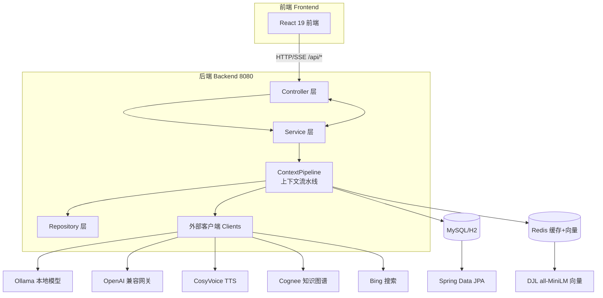

**设计核心思想**：以 `ConversationContext` 为贯穿请求全生命周期的「共享黑板」，流水线各 Stage 只读写该上下文，互相解耦；Stage 通过 `isApplicable(ctx)` 声明适用性，通过 `order` 决定执行顺序，从而让同步、流式、Agent 三种模式复用同一套 Stage 定义。

---

## 2. 技术栈选型

| 类别 | 技术 | 版本 | 用途 |
|---|---|---|---|
| 语言 | Java | 21 | 构建语言 |
| 框架 | Spring Boot | 3.2.0 | Web / JPA / Validation / Data-Redis / Test |
| 构建 | Maven | - | 依赖与构建管理 |
| LLM 框架 | LangChain4j | 1.4.0 | ChatLanguageModel、函数调用（Tool）、Agent 工具 |
| LLM 接入 | langchain4j-ollama / -open-ai | 1.4.0 | Ollama 本地模型 + OpenAI 兼容 API |
| 嵌入向量 | DJL PyTorch | 0.28.0 | 进程内本地嵌入推理（all-MiniLM-L6-v2，384 维） |
| 数据库 | MySQL（运行时）/ H2（可选） | - | 主数据源（JPA 实体） |
| 缓存/向量 | Redis | - | 短期记忆、向量存储、业务缓存、限流计数 |
| 容错 | Resilience4j | 2.1.0 | 重试 + 熔断 |
| HTTP 客户端 | OkHttp3 | 4.12.0 | 流式 HTTP 读取 |
| 文档解析 | Apache Tika | 2.9.2 | PDF/Word/Excel/PPT 等文件解析（FileParseTool） |
| 代码简化 | Lombok | 1.18.46 | 样板代码生成 |
| JSON | Jackson | - | 序列化 / SSE 转义 |

> ⚠️ **技术栈漂移提示**：`AGENTS.md` 与旧版 `backend-codebase-map.md` 仍记录 Java 17 / langchain4j 0.35.0，但 `pom.xml` 实际为 **Java 21 / langchain4j 1.4.0**。建议同步更新 AGENTS.md 以免误导。

---

## 3. 核心业务模块划分

按职责划分为 **6 大核心域 + 4 大基础设施**：

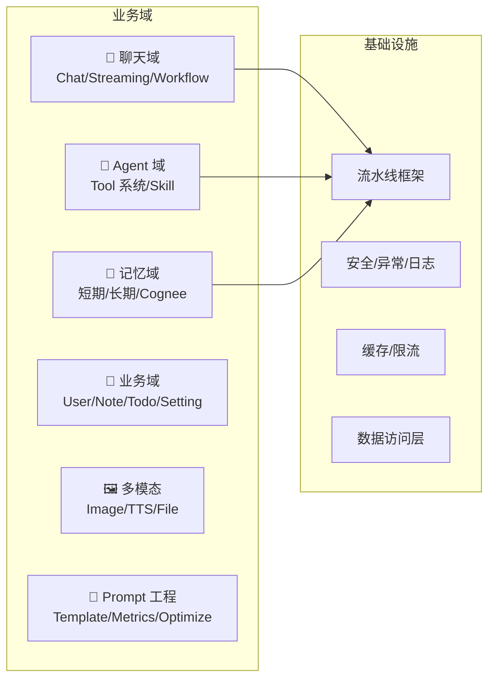

### 3.1 聊天域（核心）
- `ChatService` / `StreamingService` / `ChatWorkflowService`：同步与流式聊天编排入口。
- 流式通过 SSE 推送，采用「两阶段持久化」。
- `TitleGenerationService`：自动生成会话标题。

### 3.2 Agent 域（工具系统）
- `ToolRegistry`：启动时扫描所有 `ToolComponent` Bean 中带 `@Tool` 注解的方法，注册为工具。
- `ToolExecutor`：通过 LangChain4j `DefaultToolExecutor` 反射执行，返回统一 `ToolResultRecord`。
- 现有 **25 个工具**，分布在 13 个工具类中：

| 工具类 | 工具（@Tool 方法） |
|---|---|
| `DateTimeTool` | getCurrentDateTime |
| `FileParseTool` | parseFile、listFiles |
| `FetchUrlTool` | fetchUrl |
| `CalculatorTool` | calculator |
| `NoteTool` | createNote、listNotes、searchNotes、deleteNote |
| `TodoTool` | createTodo、listTodos、searchTodos、completeTodo、overdueTodos |
| `MemoryTool` | recallMemory、listMemories、saveMemory |
| `SetReminderTool` | 3 个提醒方法 |
| `WebSearchTool` | webSearch |
| `SummarizeTextTool` | summarizeText |
| `ImageGenerationTool` | generateImage |
| `ImageEditingTool` | editImage |
| `ImageUnderstandingTool` | understandImage |

- 工具可声明 `requiredCapability()`（如 IMAGE_IN / IMAGE_OUT），工具箱页面据此过滤可选模型。

### 3.3 记忆域
- **短期记忆**：`ShortTermMemory`（L1 内存 + Redis L2 + 数据库恢复，窗口 20 条）。
- **长期记忆**：`LongTermMemoryService` + `VectorStoreWrapper`（Redis 向量检索）+ `MemoryRecallerImpl`（召回门面）+ `MemoryExtractorImpl`（自动提取）。
- **知识图谱记忆**：`CogneeClient`（可选外部服务）。
- **Query 分析**：`QueryAnalyzer` / `QueryAnalysisAI`（规则 + LLM 混合）。

### 3.4 业务域
- 用户档案/偏好/隐私/API Key/设备（`UserProfileService`）、用户设置（`UserSettingService`）、笔记（`NoteService`）、待办（`TodoService`）、模型配置（`ModelConfigService`）、Prompt 模板/指标（`PromptTemplateService` / `PromptMetricsService`）。

### 3.5 多模态域
- `ImageService`（上传/读取）、`TtsServiceImpl`（CosyVoice 语音合成）、`ContentOptimizationServiceImpl`（内容优化）。

### 3.6 Prompt 工程
- `DefaultSystemPrompt`（默认 System Prompt v2 常量源）、`PromptTemplateMigrationRunner`（启动升级）、`PromptAssembler`（旧版，regenerate 仍在使用）。

---

## 4. 模块依赖关系与交互

### 4.1 分层依赖方向

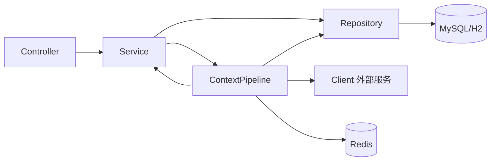

依赖遵循**单向向下**原则：Controller 只依赖 Service；Service 依赖 Repository / 外部 Client；Pipeline 内部 Stage 依赖 Service、Repository、Client，并通过 `ConversationContext` 交互，**Stage 之间不直接互相调用**。

### 4.2 聊天链路依赖

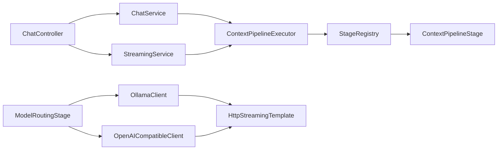

### 4.3 记忆链路依赖

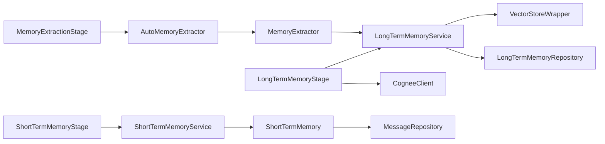

### 4.4 Agent 工具链路依赖

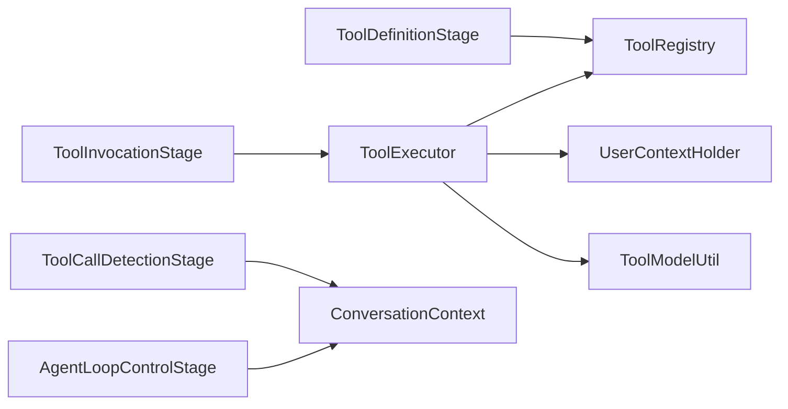

---

## 5. 数据流转路径（核心链路）

### 5.1 三种管道类型

`PipelineConfiguration` 定义了三种 `PipelineType`（`SIMPLE_CHAT` / `STREAMING_CHAT` / `AGENT_CHAT`），**当前共享同一份 FULL_PIPELINE 列表**，差异由各 Stage 的 `isApplicable(ctx)` 守卫处理：

- 流式专用 Stage 检查 `ctx.isStreaming()`
- Web 搜索检查 `ctx.isWebSearchEnabled()`
- Agent Stage 检查 `ctx.isAgentMode()` 且运行在 AGENT 阶段（600-699）

### 5.2 完整 Stage 执行顺序

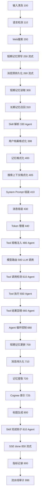

### 5.3 同步聊天数据流 `/api/chat`

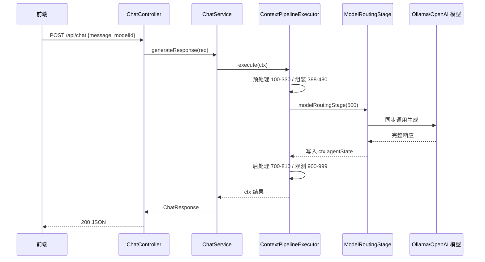

### 5.4 流式聊天数据流 `/api/chat/stream`

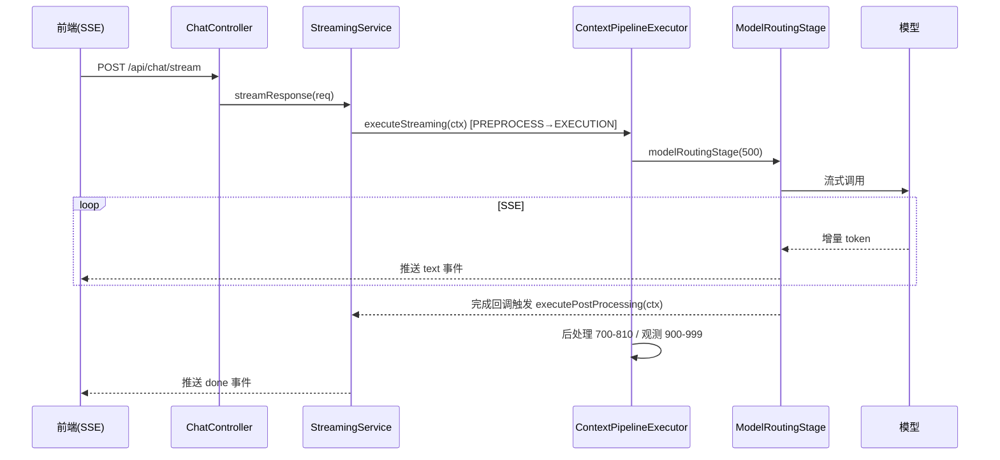

### 5.5 Agent 模式数据流（工具调用循环）

`ContextPipelineExecutor.executeWithAgentLoop` 实现**可重入循环**：

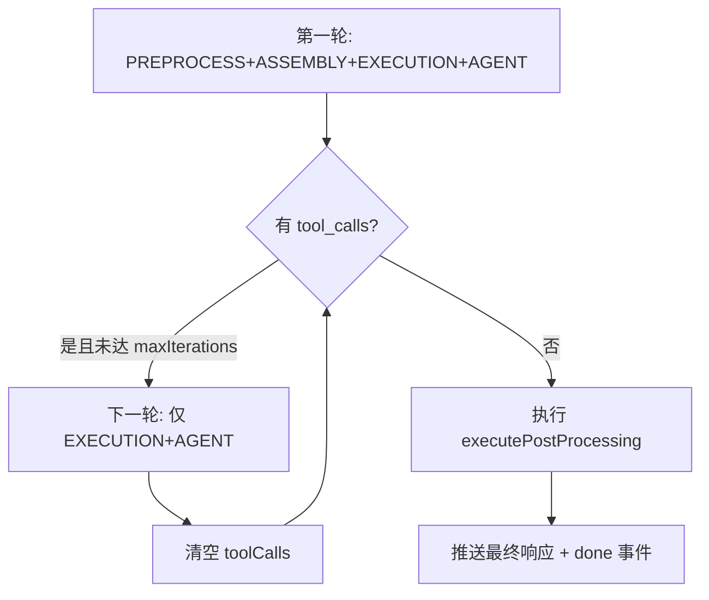

**终止条件**：`toolCalls` 为空（LLM 不再调用工具）、达到 `maxAgentIterations`、或出现不可恢复错误。

---

## 6. API 接口设计规范

### 6.1 通用规范
- **统一前缀**：`/api/*`，RESTful 风格。
- **内容协商**：默认 `application/json`（`WebConfig`）。
- **CORS**：`/api/**` 允许 `http://localhost:*`，支持 GET/POST/PUT/DELETE/PATCH/OPTIONS。
- **请求/响应**：统一使用 `dto/` 下的 DTO 类，禁止实体直出。
- **错误响应**：统一 `ErrorResponse`（`code` / `message` / `timestamp`）。

### 6.2 控制器与端点一览

| 控制器 | 前缀 | 主要端点 | 说明 |
|---|---|---|---|
| `ChatController` | `/api` | `/chat`、`/chat/stream`、`/chat/summarize`、`/chat/regenerate`、`/conversations`、`/models` | 聊天核心 |
| `ContentOptimizationController` | `/api/chat` | `/optimize` | 内容优化（限流保护） |
| `ImageController` | `/api/images` | `/upload`、`/{filename}` | 图片上传/读取 |
| `MemoryController` | `/api/memories` | 列表、按类型、详情、CRUD、召回、清理 | 长期记忆 |
| `ModelConfigController` | `/api/model-configs` | CRUD、类型、分类 | 模型配置 |
| `NoteController` | `/api/notes` | CRUD、列表 | 笔记 |
| `TodoController` | `/api/todos` | CRUD、overdue、toggle | 待办 |
| `PromptTemplateController` | `/api/prompt-templates` | CRUD、render、refresh-cache | Prompt 模板 |
| `PromptMetricsController` | `/api/prompt-metrics` | overview、statistics | Prompt 指标 |
| `TtsController` | `/api/tts` | speak、speak/stream、speakers、health | TTS |
| `UserController` | `/api/user` | profile、preferences、privacy、api-keys、devices | 用户 |
| `UserSettingController` | `/api/settings` | `/{userId}` GET/PUT/DELETE | 用户设置 |
| `FileController` | `/api/files` | 文件上传/列表/读取 | 文件管理 |
| `ToolController` | `/api/tools` | 工具箱信息 | 工具信息 |

---

## 7. 中间件使用情况

### 7.1 Resilience4j（容错）
- **重试**：`ollamaRetry`（3 次/2s）、`cosyvoiceRetry`（2 次/1s），仅对 IO/超时/运行时异常重试。
- **熔断**：`ollamaCB`（窗口 10，阈值 50%，10s 半开）、`cosyvoiceCB`（阈值 60%，15s 半开），均注册健康指标。

### 7.2 Redis（`RedisConfig`）
- `RedisTemplate<String,Object>`：Key 用 `StringRedisSerializer`，Value 用 `GenericJackson2JsonRedisSerializer`。
- `@ConditionalOnProperty(spring.data.redis.enabled)` 支持**按配置降级**（本地无 Redis 也可运行）。

### 7.3 限流切面（`RateLimitAspect`）
- 基于 Redis **滑动窗口**（ZSet）实现，通过 `@RateLimited` 注解启用。
- 当前仅保护 `ContentOptimizationController`（10 次/分钟）。
- 客户端标识优先取请求体 `userId`，否则取 IP（X-Forwarded-For / X-Real-IP / remoteAddr）。

### 7.4 Async 线程池（`AsyncConfig`）
- 流式响应专用线程池：核心 2、最大 10、队列 100、`CallerRunsPolicy`。

### 7.5 定时任务
- `@EnableScheduling` + `AutoMemoryExtractor`（记忆提取的定时扫描占位）。

---

## 8. 配置管理策略

### 8.1 配置来源与分层
- 主配置：`application.yml`（集中式，按功能分区，含详尽注释）。
- 外部化覆盖：通过**环境变量**注入，支持不同环境差异化配置。

### 8.2 环境变量占位（示例）
| 配置项 | 环境变量覆盖 |
|---|---|
| 数据源 URL | `${DB_URL:...}` |
| 用户名/密码 | `${DB_USERNAME:admin}` / `${DB_PASSWORD:...}` |
| 连接池 | `${DB_POOL_MAX_SIZE:10}` / `${DB_POOL_MIN_IDLE:5}` |
| Redis 地址 | `${REDIS_HOST:localhost}` / `${REDIS_PORT:6379}` |
| Redis 开关 | `${REDIS_ENABLED:true}` |

### 8.3 配置分区
`application.yml` 按语义分区：Spring 基础、Ollama、CosyVoice、Resilience4j、记忆系统、Prompt 工程、WebSearch、日志、限流、优化模型、OpenAI 客户端、应用级（图片）、Cognee。

### 8.4 数据库 Schema 迁移策略
- `ddl-auto: update`（JPA 自动建表/更新）——**开发环境**。
- `db/migration/` 下的 Flyway 风格 SQL 迁移（V2 用户、V3 笔记待办、V4 多模态）作为补充。
- 生产建议改为 `validate` + 正式迁移工具。

> ⚠️ **关键点**：目前 JPA `ddl-auto: update` 与手写 SQL 迁移并存，存在**双重来源风险**（表结构可能被 Hibernate 自动变更，与迁移脚本不一致）。建议生产环境统一迁移策略。

---

## 9. 安全机制实现

### 9.1 输入校验（`InputValidator`）
- 长度校验（1~4096 字符）。
- 危险字符过滤（`{{`、`{%`、`<script>`、`javascript:` 等）。
- 注入模式检测（模板注入、XSS、SQL 关键字如 EXEC/UNION/DROP/DELETE/UPDATE/INSERT）。

### 9.2 敏感信息脱敏（`SensitiveFilter`）
- 手机号、身份证、邮箱、银行卡、车牌、URL、QQ 等敏感信息脱敏。

### 9.3 API Key 管理（`APIKey` 实体）
- 用户可创建 API Key，`key` 字段唯一，带 `scopes` 权限范围。

### 9.4 CORS 与内容协商
- CORS 仅允许 `localhost` 来源，限制方法集合。

> ⚠️ **安全缺口提示**：后端**未引入 Spring Security**，无统一的认证/授权框架；用户身份主要通过 `userId` 字段传递（`UserContextHolder` 线程局部变量），`Conversation.userId` 默认 `"default"`。多用户隔离与鉴权主要依赖业务层按 `userId` 过滤，存在**水平越权风险**（同请求体内可篡改 userId）。建议引入统一身份认证（如 JWT/会话）+ 基于当前登录主体的数据范围强制过滤。

---

## 10. 异常处理流程

`GlobalExceptionHandler`（`@RestControllerAdvice`）统一处理：

| 异常 | HTTP 状态 | 错误码 |
|---|---|---|
| `MethodArgumentNotValidException` | 400 | `INVALID_INPUT`（拼接字段错误） |
| `RuntimeException` | 404（含 "not found"）/ 500 | `NOT_FOUND` / `INTERNAL_ERROR` |
| 其他 `Exception` | 500 | `INTERNAL_SERVER_ERROR`（通用兜底） |
| `HttpMediaTypeNotAcceptableException` | 500 | 空响应（SSE 已提交场景） |

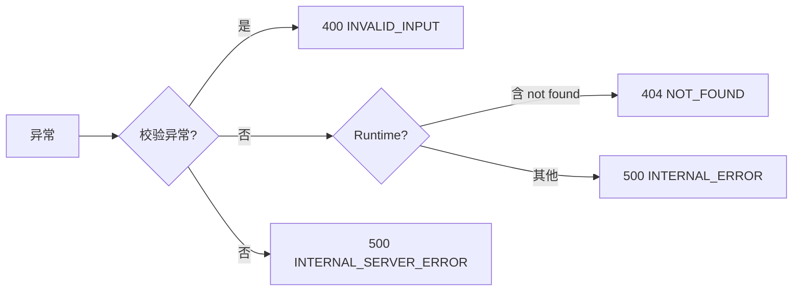

**关键点**：`pipeline` 内 Stage 异常不抛给全局处理器，由 `ContextPipelineExecutor.runStages` 捕获并记录到 `ctx`；`isCritical()` 的 Stage 失败会终止管道，非关键 Stage 失败则继续执行（容错降级）。

---

## 11. 日志系统架构

### 11.1 配置（`logback-spring.xml`）
| Logger | 级别 | 输出目标 |
|---|---|---|
| `PROMPT_LOG` | INFO | 控制台 + `logs/prompt.log`（Prompt 调用审计） |
| `com.example.app` | ERROR | 控制台 |
| `org.hibernate.*` | OFF | 全屏蔽 |
| `org.springframework` / `com.zaxxer` / `io.netty` | WARN | 控制台 |
| root | WARN | 控制台 |

### 11.2 日志特点
- **双通道**：应用日志（ERROR）+ Prompt 审计日志（`PROMPT_LOG` 独立到 `prompt.log`）。
- `PipelineAuditStage`（999）记录流水线执行摘要与各 Stage 耗时。
- `MetricsRecordingStage`（900）采集 Prompt 构建/调用指标。

> ⚠️ **优化点**：缺少按时间/大小的滚动策略（`RollingFileAppender`），生产环境 `prompt.log` 会无限增长；无结构化日志（JSON），不利于集中式日志采集（ELK/Loki）。

---

## 12. 缓存策略

### 12.1 Redis 使用场景
| 场景 | Key 模式 | TTL | 说明 |
|---|---|---|---|
| 短期记忆 | `kchat:memory:*` | 24h | 会话滑动窗口 |
| 长期记忆向量 | Redis 向量键 | - | `VectorStoreWrapper` |
| 业务缓存（笔记） | `notes:{userId}` / `note:{userId}:{id}` | 列表 5min / 单条 10min | `CacheService` |
| 业务缓存（待办） | `todos:{userId}` / `todo:{userId}:{id}` | 列表 5min / 单条 10min | `CacheService` |
| 限流计数 | `optimize:rate:*` | 60s | ZSet 滑动窗口 |
| Prompt 模板缓存 | - | 300s | `PromptTemplateService` |
| Ollama 模型列表 | - | 30s | `OllamaClient` |

### 12.2 缓存失效策略
- 业务缓存采用**写后主动失效**（`CacheService.invalidateNoteCache` / `invalidateTodoCache` 同时删除列表与单条键）。
- 无缓存穿透/击穿/雪崩的专门防护（TTL 较短可部分缓解）。

---

## 13. 数据库设计

### 13.1 实体与表

| 实体 | 表名 | 主键 | 说明 |
|---|---|---|---|
| `Conversation` | `conversation` | `id`(VARCHAR36) | 会话，含 title/modelId/tokenUsage/pinned |
| `Message` | `message` | `id`(VARCHAR36) | 消息，含 conversationId/role/content/images/artifacts |
| `LongTermMemory` | `long_term_memory` | `id`(自增) | 长期记忆，含 type/importance/embedding/metadata/source |
| `ModelConfig` | `model_configs` | `id`(自增) | 模型配置（OpenAI 兼容/Ollama 等） |
| `PromptTemplate` | `prompt_templates` | - | Prompt 模板（版本/状态） |
| `PromptMetrics` | `prompt_metrics` | - | Prompt 指标 |
| `Note` | `notes` | `id`(VARCHAR36) | 笔记 |
| `Todo` | `todos` | `id`(VARCHAR36) | 待办 |
| `UserProfile` | `user_profile` | `id`(VARCHAR36) | 用户档案（user_id 唯一） |
| `APIKey` | `api_key` | `id`(VARCHAR36) | API Key（key 唯一） |
| `UserDevice` | `user_device` | `id`(VARCHAR36) | 用户设备 |
| `UserSetting` | `user_setting` | `id`(VARCHAR36) | 用户设置（user_id 唯一，含 tool_models/enabled_tools） |
| `TtsSpeaker` | `tts_speaker` | - | 音色 |
| `Reminder` | - | - | 提醒 |

### 13.2 实体关系图

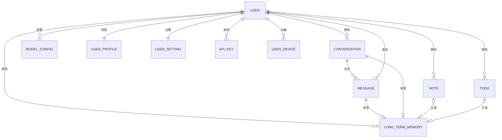

### 13.3 索引设计
- `api_key`：`idx_user_id`、`key` UNIQUE。
- `user_device`：`idx_user_id`。
- `notes`：`idx_notes_user_id`、`idx_notes_user_pinned(user_id,pinned)`、`idx_notes_user_updated(user_id,updated_at DESC)`。
- `todos`：`idx_todos_user_id`、`idx_todos_user_status`、`idx_todos_user_priority`、`idx_todos_due_date`。
- `user_profile` / `user_setting`：`user_id` UNIQUE。

### 13.4 设计特点
- **ID 策略不统一**：业务表多用 `VARCHAR(36)`（UUID 手动生成），记忆/模型配置用自增 Long。
- **embedding 存于关系库**：`LongTermMemory.embedding` 为 TEXT（JSON 数组），同时 Redis 存向量副本。
- `Message` 采用宽表 TEXT 字段存储 images/artifacts（JSON 字符串），未拆子表。

> ⚠️ **关键点**：向量在 MySQL（TEXT）与 Redis 双写，一致性需保证；`message`、`long_term_memory` 等大表缺少索引策略说明，`user_id` 高频过滤字段建议补充复合索引。

---

## 14. 部署架构及环境配置

### 14.1 运行时依赖拓扑

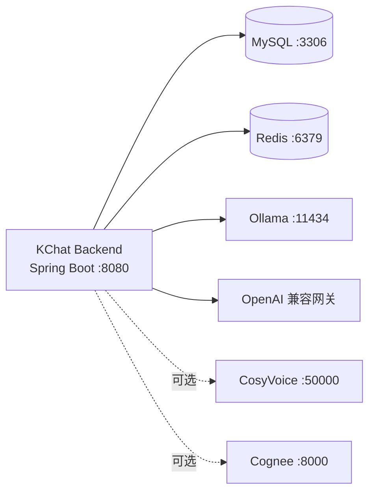

### 14.2 环境说明
- **前端**：Vite dev server 将 `/api/*` 代理到 `localhost:8080`。
- **后端默认端口**：8080。
- **首次运行**：需下载 DJL PyTorch 引擎 + 嵌入模型（~200MB）。
- **可选外部服务**：Ollama（本地模型）、CosyVoice（TTS，当前 `enabled:false`）、Cognee（知识图谱，当前 `enabled:true`）、Bing（搜索，API Key 留空则禁用）。

### 14.3 环境区分（未内置多环境 Profile）
- 目前 `application.yml` 单一配置文件 + 环境变量覆盖，**未使用** `application-dev/prod.yml` Profile 机制。
- 生产建议：`ddl-auto: validate`、开启滚动日志、引入集中配置中心（如 Nacos/Consul）与密钥管理。

---

## 15. 关键技术点标注

1. **可插拔流水线（Pipeline）设计**：`ConversationContext` 黑板模式 + Stage 的 `order`/`isApplicable`/`isCritical`，实现三模式复用与容错降级。
2. **Agent 循环**：`executeWithAgentLoop` 可重入，终止条件为 `toolCalls` 空 / 达 maxIterations；`AgentLoopControlStage` 目前仅日志，循环终止逻辑实际在 Executor。
3. **工具系统**：`ToolRegistry` 启动时反射扫描 `@Tool` 注解；`ToolExecutor` 通过 `DefaultToolExecutor` 反射执行；`UserContextHolder`（ThreadLocal）传递 userId 供工具读取自定义配置。
4. **工具默认模型优先级**：LLM `requestedModelId` > 工具箱默认（`user_setting.tool_models`）> 自动选择（`ToolModelUtil`）。
5. **流式两阶段持久化**：LLM 前写 user 消息（防丢），完成后写 AI 消息。
6. **本地向量推理**：DJL + all-MiniLM-L6-v2（384 维）进程内嵌入，避免外部嵌入服务依赖，可降级到 Ollama embedding。
7. **记忆三级架构**：内存(L1) + Redis(L2) 短期记忆；MySQL + Redis 向量长期记忆；Cognee 知识图谱可选。
8. **双 Prompt 路径**：主链路走 Pipeline + 模板渲染，`regenerate` 仍走旧 `PromptAssembler`（已废弃）。

---

## 16. 潜在优化方向

### P0（高价值，建议优先）
- **引入统一认证授权**：接入 Spring Security + JWT/会话，替代 `userId` 明文传递与 `UserContextHolder`，杜绝水平越权。
- **统一数据库迁移**：以 Flyway/Liquibase 为唯一 Schema 来源，生产 `ddl-auto: validate`，消除与 `ddl-auto:update` 的双重来源。
- **API Key 落库安全**：`ModelConfig.apiKey` 明文存储，建议加密存储（如 Jasypt/HSM）。

### P1（中价值）
- **日志滚动与结构化**：改用 `RollingFileAppender` + JSON 格式，接入集中日志。
- **向量/记忆一致性**：MySQL 与 Redis 向量双写改为一写一同步或引入最终一致机制。
- **限流泛化**：`@RateLimited` 目前仅覆盖内容优化接口，建议扩展到聊天等高频接口。
- **多环境 Profile**：拆分 dev/prod 配置，抽离密钥到配置中心。

### P2（低价值/长期）
- **短期记忆摘要**：窗口 20 条固定截断，可引入历史摘要压缩，提升长对话质量。
- **Token 动态化**：`temperature`/`max_tokens` 目前为常量，建议按模型配置动态下发。
- **Agent 终止策略增强**：`AgentLoopControlStage` 目前仅日志，可扩展 token 预算耗尽 / 目标达成判定。
- **缓存防护**：为业务缓存补充空值缓存 / 布隆过滤器，防穿透。
