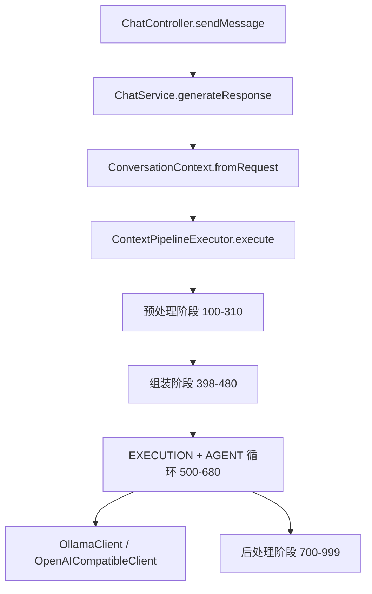
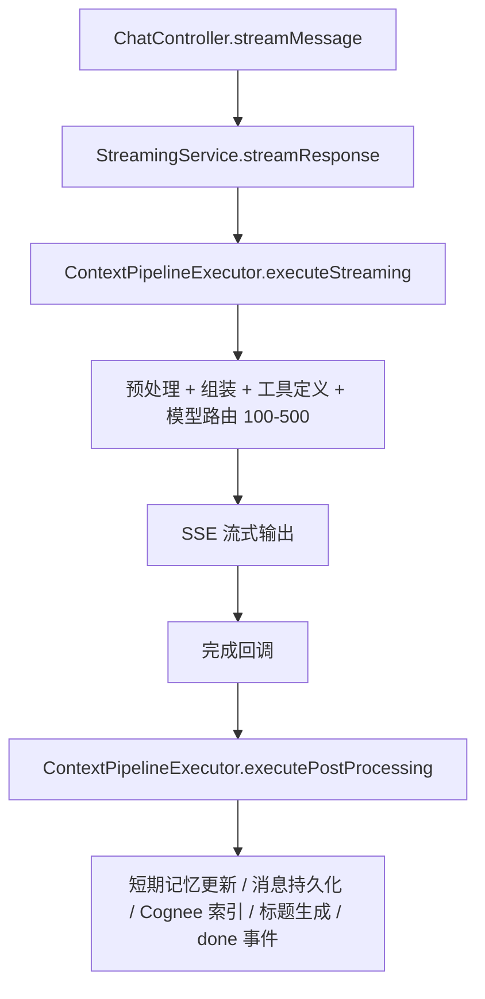
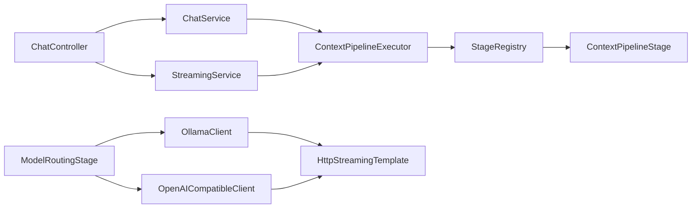
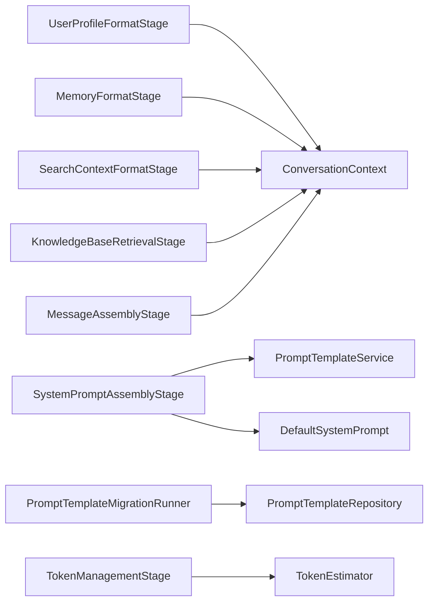

# KChat 后端代码结构地图

> 生成日期：2026-08-17
> 适用范围：`backend/` 目录，不含 `target/` 构建产物与 `uploads/images/` 运行时图片资源。

## 1. 项目概述

KChat 后端是一个 Spring Boot 3.2 + Java 21 的聊天应用后端，核心能力包括：

- 多模型聊天：支持 Ollama 本地模型与 OpenAI 兼容 API（DeepSeek、OpenAI、自定义模型等）。
- 上下文流水线：预处理、Cognee 记忆召回、System Prompt 组装、消息组装、Token 管理、模型路由、Agent 工具循环、后处理。
- 记忆系统：Redis 短期记忆（对话窗口）、Cognee 知识图谱记忆（语义检索）。
- 工具系统：35 个 Agent 工具（计算/搜索/文档/图片/笔记/待办/翻译/JSON/编码/UUID/密码等）。
- 扩展能力：Bing 联网搜索、CosyVoice TTS 语音合成、图片上传、内容优化、标题生成。
- 业务模块：用户档案、笔记、待办、模型配置、Prompt 模板、Prompt 指标、用户设置。

技术栈：Spring Boot 3.2、Spring Data JPA、MySQL/H2、Redis、langchain4j 1.4.0、Lombok、Resilience4j、Jackson、DJL 向量模型。

## 2. 目录总览

```text
backend/
├── docs/                            # 设计文档
├── pom.xml                          # Maven 构建配置
├── src/main/java/com/example/app/
│   ├── Application.java             # Spring Boot 启动入口
│   ├── aspect/                      # 切面（限流）
│   ├── client/                      # 外部服务客户端（Ollama/OpenAI/CosyVoice/HTTP 流式）
│   ├── config/                      # 配置类、属性绑定、启动迁移
│   ├── controller/                  # REST API 控制器
│   ├── dto/                         # 请求/响应模型
│   ├── entity/                      # JPA 实体
│   ├── exception/                   # 统一异常处理
│   ├── memory/                      # 短期记忆与向量存储实现
│   ├── pipeline/                    # 上下文流水线框架与各阶段
│   ├── repository/                  # JPA Repository
│   ├── security/                    # 输入校验与敏感信息脱敏
│   ├── service/                     # 业务服务接口与实现（含工具系统）
│   └── util/                        # Token 估算、JSON 工具
├── src/main/resources/
│   ├── application.yml              # 应用配置
│   ├── logback-spring.xml           # 日志配置
│   ├── db/migration/                # Flyway 风格 SQL 迁移
│   └── schema/prompt_templates.sql  # Prompt 模板初始化 SQL
├── src/test/                        # 单元测试
└── uploads/images/                  # 运行时上传的图片文件
```

## 3. 请求主链路

### 3.1 同步聊天 `/api/chat`



### 3.2 流式聊天 `/api/chat/stream`



### 3.3 流水线阶段顺序

| 顺序 | 阶段 | 阶段名 | 作用 |
|---|---|---|---|
| 100 | PREPROCESS | inputSanitizationStage | 清洗输入、防注入、脱敏 |
| 110 | PREPROCESS | languageDetectionStage | 读取用户语言偏好 |
| 200 | PREPROCESS | webSearchStage | 触发联网搜索并写入搜索上下文 |
| 250 | PREPROCESS | shortTermMemoryPreUpdateStage | 流式：LLM 调用前先把用户消息写入短期记忆 |
| 260 | PREPROCESS | messagePrePersistenceStage | 流式：LLM 调用前先把用户消息写入数据库 |
| 300 | PREPROCESS | shortTermMemoryStage | 读取会话历史并去重当前消息 |
| 310 | PREPROCESS | longTermMemoryStage | 从 Cognee 语义召回长期记忆，不再使用 JPA |
| 398 | ASSEMBLY | userProfileFormatStage | 格式化用户档案为可信上下文 |
| 400 | ASSEMBLY | memoryFormatStage | 格式化 Cognee 知识图谱结果（片段/实体/关系） |
| 405 | ASSEMBLY | searchContextFormatStage | 格式化搜索上下文并注入当前时间 |
| 408 | ASSEMBLY | knowledgeBaseRetrievalStage | 检索指定知识库片段并注入 |
| 410 | ASSEMBLY | systemPromptAssemblyStage | 渲染 System Prompt 模板（v6+） |
| 430 | ASSEMBLY | messageAssemblyStage | 组装 system + 历史 + 当前 user |
| 440 | ASSEMBLY | tokenManagementStage | Token 估算与超限截断 |
| 480 | ASSEMBLY | toolDefinitionStage | 注入 Agent 工具定义，过滤 recallMemory |
| 500 | EXECUTION | modelRoutingStage | 模型路由，支持同步/流式/Agent 模式 |
| 610 | AGENT | toolCallDetectionStage | 检测 LLM 返回的 tool_calls |
| 650 | AGENT | toolInvocationStage | 执行工具，结果回填 |
| 660 | AGENT | toolResultAssemblyStage | 组装工具结果到消息列表 |
| 680 | AGENT | agentLoopControlStage | 循环控制（最多 5 轮） |
| 700 | POSTPROCESS | shortTermMemoryUpdateStage | 把 user/AI 消息写入短期记忆 |
| 710 | POSTPROCESS | messagePersistenceStage | 把消息写入数据库 |
| 720 | POSTPROCESS | memoryExtractionStage | 触发 LLM 记忆提取（结构化事实） |
| 725 | POSTPROCESS | cogneeMemoryIndexStage | 索引对话到 Cognee 知识图谱 |
| 800 | POSTPROCESS | titleGenerationStage | 自动生成会话标题 |
| 850 | POSTPROCESS | streamingDoneStage | 发送 SSE done 事件并关闭 emitter |
| 900 | OBSERVABILITY | metricsRecordingStage | 记录 Prompt 指标 |
| 999 | OBSERVABILITY | pipelineAuditStage | 输出流水线执行摘要与阶段耗时 |

## 4. 文件清单

### 4.1 启动与配置（`config/`）

| 文件 | 作用 | 关联 |
|---|---|---|
| `Application.java` | Spring Boot 启动入口，扫描 `com.example.app` 下所有 Bean。 | 所有模块 |
| `AsyncConfig.java` | 创建流式响应专用线程池（核心 2、最大 10、队列 100、CallerRunsPolicy）。 | `ModelRoutingStage`、`CosyVoiceClient` |
| `CogneeProperties.java` | 绑定 `cognee.*` 配置，控制知识图谱记忆开关、地址、检索 TopK 与阈值。 | `CogneeClient`、`LongTermMemoryStage`、`CogneeMemoryIndexStage` |
| `CosyVoiceConfig.java` | 绑定 `cosyvoice.*` 配置，包括地址、默认音色、语速、超时。 | `CosyVoiceClient`、`TtsServiceImpl` |
| `DefaultSystemPrompt.java` | 默认 System Prompt 的唯一 Java 常量来源（v6+），含占位符模板、版本号、默认参数。 | `SystemPromptAssemblyStage`、`PromptTemplateMigrationRunner` |
| `MemoryExtractorConfig.java` | 绑定 `memory.extractor.*`，控制提取开关、消息阈值、置信度/重要性阈值。 | `AutoMemoryExtractor`、`MemoryExtractorImpl` |
| `OllamaConfig.java` | 绑定 `ollama.*` 配置，并创建 langchain4j `ChatLanguageModel` Bean。 | `OllamaClient`、`StreamingConfig` |
| `PromptTemplateMigrationRunner.java` | 应用启动时升级默认 System Prompt 版本。 | `PromptTemplateRepository`、`DefaultSystemPrompt` |
| `RedisConfig.java` | 配置 RedisTemplate 的 Key/Value 序列化策略，条件启用 Redis。 | `ShortTermMemory`、`CacheService`、`RateLimitAspect` |
| `StreamingConfig.java` | 创建 langchain4j `StreamingChatLanguageModel` Bean（Ollama 流式模型）。 | `OllamaClient` |
| `WebConfig.java` | 默认 JSON 内容协商与 `/api/**` CORS 配置。 | 所有控制器 |
| `WebSearchConfig.java` | 绑定 `websearch.*` 配置，控制搜索开关、超时、结果数、引擎。 | `WebSearchStage`、`WebSearchServiceImpl` |

### 4.2 切面（`aspect/`）

| 文件 | 作用 | 关联 |
|---|---|---|
| `RateLimitAspect.java` | 基于 Redis 的滑动窗口限流切面，通过 `@RateLimited` 注解启用。 | `ContentOptimizationController`、`RedisConfig` |

### 4.3 外部客户端（`client/`）

| 文件 | 作用 | 关联 |
|---|---|---|
| `CosyVoiceClient.java` | CosyVoice FastAPI 客户端，封装健康检查、音色管理、音频合成与流式合成，带重试和熔断。 | `TtsController`、`TtsServiceImpl` |
| `HttpStreamingTemplate.java` | 底层 HTTP 流式读取模板，支持 JSON、SSE、Ollama NDJSON 三种响应格式。 | `OllamaClient`、`OpenAICompatibleClient` |
| `OllamaClient.java` | 调用 Ollama `/api/chat`，支持同步/流式/图片消息，带模型缓存、重试与熔断。 | `ModelRoutingStage`、`ChatService`、`ContentOptimizationServiceImpl` |
| `OpenAICompatibleClient.java` | 调用任意 OpenAI 兼容 `/v1/chat/completions`，支持同步/流式、图片生成、SD WebUI，统一 temperature/max_tokens 常量。 | `ModelRoutingStage`、`ContentOptimizationServiceImpl`、`ChatController`、`TitleGenerationService` |

### 4.4 控制器（`controller/`）

| 文件 | 路由前缀 | 主要端点 | 作用 |
|---|---|---|---|
| `ChatController.java` | `/api` | `/chat`、`/chat/stream`、`/chat/summarize`、`/chat/regenerate`、`/conversations`、`/models` | 聊天、流式聊天、总结、重新生成、会话管理、模型列表 |
| `ContentOptimizationController.java` | `/api/chat` | `/optimize` | 内容优化，触发 `ContentOptimizationService` |
| `ImageController.java` | `/api/images` | `/upload`、`/{filename}` | 图片上传、读取、删除 |
| `ModelConfigController.java` | `/api/model-configs` | 配置列表、类型、分类、CRUD | 管理 OpenAI 兼容模型配置 |
| `NoteController.java` | `/api/notes` | 列表、详情、创建、更新、删除 | 笔记 CRUD |
| `PromptMetricsController.java` | `/api/prompt-metrics` | overview、recent、按会话/用户/时间范围、statistics | Prompt 指标查询 |
| `PromptTemplateController.java` | `/api/prompt-templates` | CRUD、active、render、default-system、refresh-cache | Prompt 模板管理、渲染、缓存刷新 |
| `TodoController.java` | `/api/todos` | 列表、overdue、详情、CRUD、toggle | 待办 CRUD |
| `TtsController.java` | `/api/tts` | speak、speak/stream、preview、speakers、health | TTS 语音合成与音色管理 |
| `UserController.java` | `/api/user` | profile、preferences、privacy、api-keys、devices | 用户档案、偏好、隐私、API Key、设备管理 |
| `UserSettingController.java` | `/api/settings` | `/{userId}` GET/PUT/DELETE | 用户设置（默认模型、上下文大小、自动标题等） |
| `ToolController.java` | `/api/tools` | list | 列举 Agent 工具信息 |

### 4.5 DTO（`dto/`）

| 文件 | 作用 |
|---|---|
| `ChatRequest.java` / `ChatResponse.java` | 聊天请求（用户消息、会话、模型、图片、搜索开关、Agent 模式、知识库引用）与响应 |
| `ConversationDTO.java` / `MessageDTO.java` | 会话与消息的传输模型 |
| `RegenerateRequest.java` / `RegenerateResponse.java` | 重新生成请求与响应 |
| `SummarizeRequest.java` / `SummarizeResponse.java` | 对话总结请求与响应 |
| `ContentOptimizationRequest.java` / `ContentOptimizationResponse.java` | 内容优化请求与响应（含优化详情） |
| `ModelConfigDTO.java` | 模型配置创建/更新请求 |
| `NoteDTO.java` / `CreateNoteRequest.java` / `UpdateNoteRequest.java` | 笔记模型 |
| `TodoDTO.java` / `CreateTodoRequest.java` / `UpdateTodoRequest.java` | 待办模型 |
| `UserProfileDTO.java` / `UpdateProfileRequest.java` | 用户档案 |
| `UserPreferences.java` / `UpdatePreferencesRequest.java` | 用户偏好 |
| `UserPrivacy.java` / `UpdatePrivacyRequest.java` | 隐私设置 |
| `NotificationSettings.java` | 通知设置 |
| `APIKeyDTO.java` / `CreateAPIKeyRequest.java` | API Key |
| `UserDeviceDTO.java` | 用户设备 |
| `UserSettingDTO.java` | 用户设置 |
| `WebSearchResult.java` | 搜索结果的统一封装（含 SearchSnippet 内部类） |
| `QueryAnalysisResult.java` | 查询分析结果（有效查询、类型过滤） |
| `tts/CosyVoiceHealth.java` | TTS 服务健康状态 |
| `tts/PreviewRequest.java` / `tts/SpeakRequest.java` | TTS 试听与合成请求 |
| `tts/SpeakerVo.java` / `tts/TtsResult.java` | 音色信息与合成结果 |

### 4.6 实体（`entity/`）

| 文件 | 对应表 | 作用 |
|---|---|---|
| `APIKey.java` | `api_key` | 用户 API Key |
| `Conversation.java` | `conversation` | 会话（标题、置顶等） |
| `Message.java` | `message` | 会话消息（角色、内容、图片 JSON、时间戳） |
| `ModelConfig.java` | `model_configs` | OpenAI 兼容模型配置（名称、模型 ID、BaseURL、API Key、类型、分类） |
| `Note.java` | `notes` | 笔记 |
| `PromptMetrics.java` | `prompt_metrics` | Prompt 构建/调用指标 |
| `PromptTemplate.java` | `prompt_templates` | Prompt 模板（内容、版本、启用状态、默认参数） |
| `Todo.java` | `todos` | 待办 |
| `TtsSpeaker.java` | `tts_speaker` | 用户音色 |
| `UserDevice.java` | `user_device` | 用户设备 |
| `UserProfile.java` | `user_profile` | 用户档案（昵称、邮箱、简介、语言、偏好、隐私） |
| `UserSetting.java` | `user_setting` | 用户设置 |

### 4.7 异常处理（`exception/`）

| 文件 | 作用 |
|---|---|
| `ErrorResponse.java` | 统一错误响应结构（code、message、timestamp） |
| `GlobalExceptionHandler.java` | 全局异常处理：参数校验、RuntimeException、兜底异常 |

### 4.8 记忆基础设施（`memory/`）

| 文件 | 作用 | 关联 |
|---|---|---|
| `ShortTermMemory.java` | 会话短期记忆：L1 内存 + Redis L2 + 数据库恢复，窗口上限 20 条消息，写时持久化。 | `ShortTermMemoryService`、`MessageRepository`、Redis |

### 4.9 流水线框架（`pipeline/`）

| 文件 | 作用 |
|---|---|
| `ContextPipelineExecutor.java` | 执行器：同步全流程、流式预执行、流式后处理、Agent 循环。 |
| `ContextPipelineStage.java` | 阶段接口：定义阶段名、执行、Phase、顺序、适用性、是否关键。 |
| `StageRegistry.java` | 自动收集并排序所有 `ContextPipelineStage` Bean。 |
| `config/PipelineConfiguration.java` | 定义各 PipelineType 的阶段列表（三种类型共享同一列表）。 |
| `context/ConversationContext.java` | 贯穿流水线的共享上下文，承载请求、记忆、组装结果、LLM 响应、agentState、指标等。 |
| `stage/assembly/UserProfileFormatStage.java` | 格式化用户档案为"可信"上下文段。 |
| `stage/assembly/MemoryFormatStage.java` | 格式化 Cognee 知识图谱结果（片段/实体/关系），不再格式化 JPA 记忆。 |
| `stage/assembly/SearchContextFormatStage.java` | 格式化搜索上下文，带当前时间。 |
| `stage/assembly/KnowledgeBaseRetrievalStage.java` | 检索指定知识库片段并注入系统提示。 |
| `stage/assembly/SystemPromptAssemblyStage.java` | 渲染 System Prompt，注入语言、档案、记忆、搜索上下文，记录模板版本。 |
| `stage/assembly/MessageAssemblyStage.java` | 组装 system + 历史 + 当前 user 消息。 |
| `stage/assembly/TokenManagementStage.java` | Token 估算与截断，保证 system 和当前 user 不丢。 |
| `stage/agent/ToolDefinitionStage.java` | 注入 Agent 工具定义，用户已关闭的工具不出现，知识库引用时过滤 recallMemory。 |
| `stage/agent/ToolCallDetectionStage.java` | 检测 LLM 返回的 tool_calls，清空并填充上下文。 |
| `stage/agent/ToolInvocationStage.java` | 执行工具调用，结果回填，提取图片 artifact。 |
| `stage/agent/ToolResultAssemblyStage.java` | 组装工具结果到消息列表，供下一轮 LLM 使用。 |
| `stage/agent/AgentLoopControlStage.java` | 记录迭代日志，实际终止由 Executor 检查。 |
| `stage/execution/ModelRoutingStage.java` | 模型路由：选择 Ollama 或 OpenAI 兼容客户端，写 prompt.log，支持同步/流式/Agent 模式。 |
| `stage/preprocess/InputSanitizationStage.java` | 输入清洗与脱敏。 |
| `stage/preprocess/LanguageDetectionStage.java` | 读取用户语言。 |
| `stage/preprocess/WebSearchStage.java` | 执行搜索并写 `searchContext`，SSE 推送结果。 |
| `stage/preprocess/ShortTermMemoryPreUpdateStage.java` | 流式预写用户消息到短期记忆。 |
| `stage/preprocess/MessagePrePersistenceStage.java` | 流式预写用户消息到数据库。 |
| `stage/preprocess/ShortTermMemoryStage.java` | 读取会话历史并去重尾部重复消息。 |
| `stage/preprocess/LongTermMemoryStage.java` | 从 Cognee 语义召回长期记忆（片段/实体/关系），不再使用 JPA。 |
| `stage/postprocess/ShortTermMemoryUpdateStage.java` | 响应后更新短期记忆。 |
| `stage/postprocess/MessagePersistenceStage.java` | 响应后持久化 user/AI 消息。 |
| `stage/postprocess/MemoryExtractionStage.java` | 触发 LLM 记忆提取（结构化事实提取，不写入 JPA）。 |
| `stage/postprocess/CogneeMemoryIndexStage.java` | 将提取的结构化记忆索引到 Cognee 知识图谱。 |
| `stage/postprocess/TitleGenerationStage.java` | 新对话自动生成标题。 |
| `stage/postprocess/StreamingDoneStage.java` | 发送 SSE done 事件并关闭 emitter。 |
| `stage/observability/MetricsRecordingStage.java` | 记录 Prompt 指标。 |
| `stage/observability/PipelineAuditStage.java` | 记录流水线执行摘要与阶段耗时。 |

### 4.10 数据访问层（`repository/`）

| 文件 | 作用 |
|---|---|
| `APIKeyRepository.java` | API Key 查询 |
| `ConversationRepository.java` | 会话 CRUD |
| `MessageRepository.java` | 消息按会话/时间查询与删除 |
| `ModelConfigRepository.java` | 模型配置查询 |
| `NoteRepository.java` | 笔记查询 |
| `PromptMetricsRepository.java` | Prompt 指标统计查询 |
| `PromptTemplateRepository.java` | Prompt 模板按名称/版本/状态查询 |
| `TodoRepository.java` | 待办查询（含过期） |
| `TtsSpeakerRepository.java` | 音色 CRUD |
| `UserDeviceRepository.java` | 设备查询与删除 |
| `UserProfileRepository.java` | 用户档案按 userId 查询 |
| `UserSettingRepository.java` | 用户设置查询 |

### 4.11 安全（`security/`）

| 文件 | 作用 |
|---|---|
| `InputValidator.java` | 输入长度校验、危险模式检测（模板注入、XSS、SQL 关键字）。 |
| `SensitiveFilter.java` | 手机号、身份证、邮箱、银行卡、车牌、URL、QQ 等敏感信息脱敏。 |

### 4.12 业务服务（`service/` 与 `service/impl/`）

| 文件 | 作用 |
|---|---|
| `ChatService.java` | 同步聊天编排入口，驱动 Context Pipeline；regenerate 走旧路径。 |
| `StreamingService.java` | 流式聊天入口，创建 SSE emitter 并驱动流式 pipeline。 |
| `ChatWorkflowService.java` | 聊天流程门面：会话创建、短期记忆、Cognee 记忆召回、旧版兼容接口。 |
| `AutoMemoryExtractor.java` | 记忆提取调度：消息阈值触发。 |
| `MemoryExtractor.java` / `impl/MemoryExtractorImpl.java` | 从对话提取结构化事实（LLM 提取、JSON 解析、规则降级），不再写入 JPA。 |
| `ShortTermMemoryService.java` | 短期记忆服务，委托 `ShortTermMemory`。 |
| `MessagePersistenceService.java` | 消息数据库持久化，支持同步批量保存与流式两阶段保存。 |
| `ConversationService.java` | 会话 CRUD，删除时级联清理消息与短期记忆。 |
| `ConversationMessageCounter.java` | 会话消息计数（内存态），用于记忆提取阈值。 |
| `ModelConfigService.java` | 模型配置 CRUD，读取 Ollama 模型列表，按 modelId 获取配置。 |
| `PromptTemplateService.java` | Prompt 模板 CRUD、版本管理、缓存、渲染占位符。 |
| `PromptMetricsService.java` | Prompt 指标记录与统计查询。 |
| `CacheService.java` | 笔记/待办的 Redis 缓存读写。 |
| `NoteService.java` | 笔记业务逻辑（含缓存）。 |
| `TodoService.java` | 待办业务逻辑（含缓存）。 |
| `UserProfileService.java` | 用户档案、偏好、隐私、API Key、设备管理。 |
| `UserSettingService.java` | 用户设置读写（默认模型、上下文大小、自动标题）。 |
| `TitleGenerationService.java` | 根据 user/AI 内容生成 3-15 字标题。 |
| `ContentOptimizationService.java` / `impl/ContentOptimizationServiceImpl.java` | 按优化类型生成 system prompt 并调用模型优化内容。 |
| `TtsService.java` / `impl/TtsServiceImpl.java` | TTS 合成、流式合成、预览、音色注册/权限校验。 |
| `WebSearchService.java` / `impl/WebSearchServiceImpl.java` | Bing API/HTML 抓取搜索实现。 |
| `CogneeClient.java` | Cognee REST API 客户端：remember/recall/recallWithContext/getGraph/forgetDataset。 |
| `ImageService.java` | 图片文件上传、读取、删除、列表。 |

### 4.13 工具系统（`service/tool/`）

| 文件 | 作用 |
|---|---|
| `ToolComponent.java` | 工具标记接口，实现此接口的 Spring Bean 中 `@Tool` 方法自动注册为 Agent 工具。 |
| `ToolRegistry.java` | 启动时扫描所有 `ToolComponent` Bean，注册工具名 → 方法 + `ToolSpecification`。 |
| `ToolSpecificationProvider.java` | 按用户过滤已禁用工具，生成 `ToolSpecification` 列表。 |
| `ToolExecutor.java` | 反射执行工具方法，管理 `UserContextHolder` 和 `ToolModelUtil` 包装/解包。 |
| `UserContextHolder.java` | ThreadLocal 持有当前用户 ID，工具执行时设置，`finally` 清理。 |
| `ToolModelUtil.java` | 工具结果模型标记包装/解包工具。 |
| `tools/CalculatorTool.java` | 数学计算 |
| `tools/DateTimeTool.java` | 获取当前日期时间 |
| `tools/WebSearchTool.java` | 网页搜索 |
| `tools/FetchUrlTool.java` | 获取 URL 内容 |
| `tools/FileParseTool.java` | 解析/列出上传文件 |
| `tools/DocumentTool.java` | 文档 CRUD（创建/读取/搜索/列出/删除） |
| `tools/ImageEditingTool.java` | 编辑图片 |
| `tools/ImageGenerationTool.java` | 生成图片 |
| `tools/ImageUnderstandingTool.java` | 分析图片 |
| `tools/NoteTool.java` | 笔记 CRUD（搜索/创建/删除/列出） |
| `tools/SetReminderTool.java` | 提醒管理（创建/取消/列出） |
| `tools/SummarizeTextTool.java` | 文本总结 |
| `tools/TodoTool.java` | 待办管理（列出/完成/搜索/过期/创建） |
| `tools/TranslateTool.java` | 文本翻译 |
| `tools/JsonFormatTool.java` | JSON 格式化/压缩/验证 |
| `tools/EncodeDecodeTool.java` | Base64/URL 编码解码 |
| `tools/UuidTool.java` | UUID 生成 |
| `tools/GeneratePasswordTool.java` | 密码生成 |
| `tools/CogneeMemoryTool.java` | 记忆工具（recallMemory/saveMemory/listMemories，基于 Cognee） |

### 4.14 工具（`util/`）

| 文件 | 作用 |
|---|---|
| `TokenEstimator.java` | Token 估算接口。 |
| `DefaultTokenEstimator.java` | 默认估算器：优先 jtokkit/tiktoken，不可用时降级简单估算。 |
| `SimpleTokenEstimator.java` | 基于字符数的简单估算，区分中英文。 |
| `JsonUtils.java` | JSON 序列化/反序列化与 SSE 转义工具。 |
| `PromptAssembler.java` | 旧版 Prompt 组装器（已标记 deprecated），regenerate 路径仍在使用。 |

### 4.15 资源配置（`src/main/resources/`）

| 文件 | 作用 |
|---|---|
| `application.yml` | 数据源、Redis、Ollama、CosyVoice、记忆、Prompt、WebSearch、限流、日志等全部配置。 |
| `logback-spring.xml` | 日志格式与级别，`PROMPT_LOG` 输出到控制台和 `logs/prompt.log`。 |
| `schema/prompt_templates.sql` | 初始化 `prompt_templates` 表并写入默认 System Prompt，包含幂等升级语句。 |
| `db/migration/V2__create_user_profile_tables.sql` | 创建用户档案、API Key、用户设备表。 |
| `db/migration/V3__create_notes_todos_tables.sql` | 创建笔记、待办表。 |

### 4.16 测试（`src/test/`）

| 文件 | 作用 |
|---|---|
| `TestConfig.java` | 测试配置。 |
| `controller/ChatControllerTest.java` | ChatController 会话 CRUD 测试。 |
| `controller/ContentOptimizationControllerTest.java` | 内容优化控制器测试。 |

### 4.17 其他

| 路径 | 说明 |
|---|---|
| `docs/cosyvoice-integration-plan.md` | CosyVoice 集成方案文档。 |
| `uploads/images/` | 运行时上传图片的本地存储目录。 |
| `.impeccable/hook.cache.json` | Impeccable 工具缓存，非业务代码。 |

## 5. 关键关联关系

### 5.1 聊天链路



### 5.2 记忆链路

```mermaid
flowchart LR
  LongTermMemoryStage --> CogneeClient
  CogneeClient --> [Cognee REST API]
  MemoryExtractionStage --> AutoMemoryExtractor
  AutoMemoryExtractor --> MemoryExtractor
  MemoryExtractor --> CogneeMemoryIndexStage
  CogneeMemoryIndexStage --> CogneeClient
  ShortTermMemoryStage --> ShortTermMemoryService
  ShortTermMemoryService --> ShortTermMemory
  ShortTermMemory --> MessageRepository
```

### 5.3 Prompt 组装链路



## 6. 值得注意的设计点与债务

- 主聊天已迁移到 Context Pipeline，但 `PromptAssembler` 仍用于 regenerate，属于双路径。
- 流式聊天使用"两阶段持久化"：LLM 调用前写 user 消息，完成后写 AI 消息。
- `temperature`/`max_tokens` 目前仍是常量（`OpenAICompatibleClient`），尚未按模型配置动态下发。
- 短期记忆窗口固定 20 条；Token 截断按消息尾部保留，未做历史摘要。
- 默认 System Prompt 由 `DefaultSystemPrompt`、SQL、启动迁移三者保持一致，避免模板漂移。
- JPA 长期记忆已完全移除，所有记忆功能迁移至 Cognee 知识图谱。
- Agent 工具系统支持 35 个工具，通过 `ToolComponent` 接口自动注册。
- 记忆提取走 LLM 结构化提取 + Cognee 索引，不再写入 JPA，消除双写不一致问题。
- `UserContextHolder` 使用 ThreadLocal 模式，需注意 finally 清理。
- 后端运行在 JDK 25，Mockito 5.7 兼容性问题导致部分测试被移除（ChatServiceTest、ShortTermMemoryServiceTest 等）。