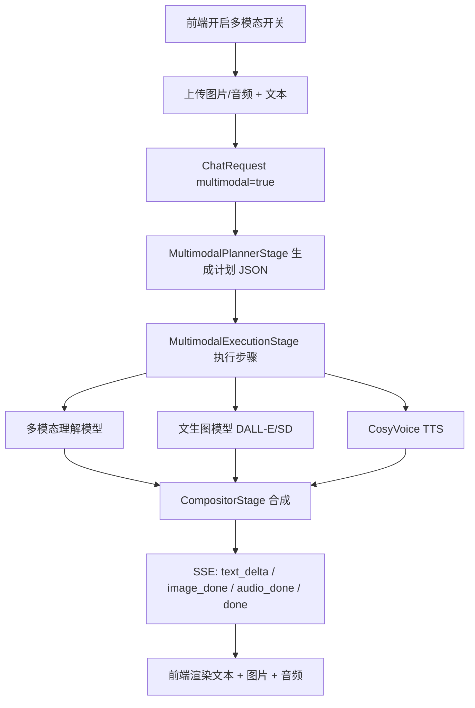

# KChat 多模态 Auto 模式实施计划

> 状态：待实施
> 核心原则：输入框新增多模态开关；只有开关开启时才走多模态编排，其他情况保持现有单模型行为不变。

## 1. 目标

- 支持“文本 + 图片”输入，同时输出文本和图片，后续扩展到音频输入/输出。
- 用 `Auto` 模式分析用户输入，自动组合不同模型完成任务。
- 复用现有 Context Pipeline、OllamaClient、OpenAICompatibleClient、CosyVoice、图片上传等能力。

## 2. 总体架构



## 3. 阶段划分

| 阶段 | 内容 | 产出 |
|---|---|---|
| Phase 0 | 模型能力注册表 + Auto 虚拟模型 | 后端能识别模型支持什么 |
| Phase 1 | Auto 路由 + 图片理解 + 文生图 | 文本 + 图片输入输出 |
| Phase 2 | Planner + Compositor | 自动拆分多步任务 |
| Phase 3 | 音频输入输出 | 文本 + 图片 + 语音 |
| Phase 4 | 工具/Agent 化 | 搜索、网页、任务编排 |

## 4. 后端任务清单

### B1 模型能力注册表
- [x] `ModelConfig` 增加 `capabilities` JSON 字段，按“模态 × 方向”建模：`TEXT_IN/IMAGE_IN/AUDIO_IN/VIDEO_IN` 与 `TEXT_OUT/IMAGE_OUT/AUDIO_OUT/VIDEO_OUT`。
- [ ] `ModelConfigDTO` 暴露 capabilities。
- [x] `ModelConfigService` 增加 `getCapabilities(modelId)`，并为 Ollama 模型提供能力推断（如视觉模型名单）。
- [x] 默认按 `ModelCategory` 兜底：IMAGE 模型默认 `IMAGE_OUT`，TEXT 模型默认 `TEXT_IN/TEXT_OUT`。
- [x] 兼容旧能力名：`VISION→IMAGE_IN`、`IMAGE_GEN→IMAGE_OUT`、`TTS→AUDIO_OUT`、`VIDEO→VIDEO_OUT`。

### B2 多模态开关与路由
- [x] `ChatRequest` 增加 `multimodal` 布尔字段。
- [x] `ChatService` 根据 `request.isMultimodal()` 设置 `ctx.setMultimodal(true)`。
- [x] `ModelRoutingStage` 在多模态模式下不直接走单模型路由，而是交给多模态执行阶段。
- [x] 开关关闭时完全保持现有逻辑。

### B3 ConversationContext 扩展
- [ ] 新增字段：
  - `userMedia`：图片/音频输入列表
  - `plannerPlan`：Planner 输出的计划 JSON
  - `executionResults`：各步骤执行结果
  - `artifacts`：最终图片/音频产物
  - `multimodalResponse`：统一响应结构
- [ ] 新增常量 key：`KEY_MULTIMODAL_PLAN`、`KEY_MULTIMODAL_ARTIFACTS`。

### B4 MultimodalPlannerStage
- [ ] 新增 `MultimodalPlannerStage`，放在 PREPROCESS 阶段，仅在 `model == "auto"` 时适用。
- [ ] 用轻量 Planner 模型分析用户输入 + 图片元数据，输出计划 JSON：

```json
{
  "steps": [
    { "type": "vision", "target": "images[0]", "instruction": "描述图片" },
    { "type": "text", "content": "用中文回答" },
    { "type": "image_gen", "prompt": "根据图片生成相似插画" },
    { "type": "tts", "text": "生成语音简介" }
  ],
  "max_steps": 4
}
```

- [ ] 计划校验：类型白名单、步骤数上限、目标索引越界检查。
- [ ] Planner 模型可通过配置指定：`multimodal.planner-model`，默认复用 `optimization.model`。

### B5 MultimodalExecutionStage
- [ ] 新增执行阶段，按计划顺序或并行执行。
- [ ] `vision`：调用支持 VISION 的模型，把图片 URL 拼进 user 消息。
- [ ] `image_gen`：调用 `OpenAICompatibleClient.generateImage` / SD WebUI，或 Ollama 图片生成能力。
- [ ] `text`：调用聊天模型并流式输出。
- [ ] `tts`：调用 `CosyVoiceClient`，生成音频 URL。
- [ ] 并行执行时使用 `AsyncConfig.streamingExecutorService`，设置最大并发 2。
- [ ] 单步失败不整体失败：记录 error，继续后续步骤。

### B6 CompositorStage
- [ ] 新增合成阶段，汇总各步骤结果到统一结构：

```json
{
  "text": "……",
  "images": ["/api/images/a.png"],
  "audioUrl": "/api/tts/audio/a.wav",
  "artifacts": [
    { "type": "image", "url": "/api/images/a.png" },
    { "type": "audio", "url": "/api/tts/audio/a.wav" }
  ]
}
```

- [ ] 把合成结果写入 `ctx.llmResponse`（文本部分）和 `ctx.artifacts`。

### B7 SSE 与响应协议
- [x] `StreamingDoneStage` 扩展发送 `artifacts`。
- [x] 新事件：
  - `text_delta`：文本增量（可复用现有 `message`）
  - `image_done`：`{ "url": "..." }`
  - `audio_done`：`{ "url": "..." }`
  - `done`：`{ "messageId": "...", "artifacts": [...] }`
- [x] `ChatResponse` 增加 `images`、`audioUrl`、`artifacts`。

### B8 持久化
- [ ] `Message` 实体扩展 `artifacts` JSON 字段（或复用 `images` 并新增 `audio_url`）。
- [ ] `MessagePersistenceService` 保存多模态产物。
- [ ] `MessageDTO`/`ConversationDTO` 返回 artifacts。
- [ ] 图片上传继续走现有 `ImageController`；音频产物由 CosyVoice 生成后落到可访问 URL。

### B9 记忆与上下文
- [ ] Auto 模式下，图片内容先由 VISION 模型生成文字摘要，再进入短期/长期记忆。
- [ ] 记忆提取继续走现有 `MemoryExtractor`，只提取文本摘要。
- [ ] Token 预算考虑图片 token：限制单次最多 N 张图片、压缩尺寸。

### B10 后端测试
- [ ] Planner JSON 生成与校验单元测试。
- [ ] Auto 路由测试：`model=auto` 走多模态，`model=llama3` 走旧路径。
- [ ] Compositor 测试：多步骤结果合成。
- [ ] 失败降级测试：图片生成失败仍返回文本。

## 5. 前端任务清单

### F1 多模态开关
- [x] `frontend/src/components/chat/InputArea/index.tsx`：工具栏新增多模态开关。
- [x] `frontend/src/context/ChatContext.tsx`：开关开启时请求带 `multimodal: true`。

### F2 多模态输入
- [ ] 输入区增加图片上传按钮（复用 `images.upload`）。
- [ ] `sendMessage` 支持传 `imageUrls`、`audioUrl`。
- [ ] 非 Auto 模式隐藏或禁用图片/音频入口。

### F3 流式解析
- [x] `frontend/src/api/client.ts` / `api/chat.ts` 的 SSE 解析支持命名事件。
- [x] 接收 `image_done`、`audio_done` 并更新消息状态。
- [x] `frontend/src/context/chatReducer.ts` 的 streaming state 增加 `artifacts`。

### F4 消息渲染
- [ ] 消息气泡支持渲染图片列表和音频播放器。
- [ ] 历史消息读取时展示已持久化的 artifacts。
- [ ] 类型定义更新：`frontend/src/types/index.ts` 增加 `artifacts`。

## 6. API 契约

### ChatRequest

```json
{
  "conversationId": "xxx",
  "message": "分析这张图并生成一张类似图片",
  "model": "deepseek-v4-flash",
  "imageUrls": ["/api/images/xxx.png"],
  "audioUrl": null,
  "webSearch": false,
  "multimodal": true
}
```

### SSE 事件

```text
event: message
data: {"content":"文本增量"}

event: image_done
data: {"url":"/api/images/xxx.png"}

event: audio_done
data: {"url":"/api/tts/audio/xxx.wav"}

event: done
data: {"messageId":"xxx","artifacts":[...]}
```

## 7. 验收标准

- [ ] 多模态开关关闭：行为和普通聊天一致。
- [ ] 多模态开关开启 + 图片 + 文本：能理解图片并返回文本。
- [ ] 多模态开关开启 + “生成一张猫的图片”：只调用文生图，返回图片 URL。
- [ ] 多模态开关开启 + 图片 + “分析并生成类似图”：Planner 拆成 vision + image_gen，返回文本 + 图片。
- [ ] 多模态开关关闭：不支持图片时不报错、不改变现有行为。
- [ ] 图片生成失败：返回明确文本说明，不崩溃。

## 8. 风险与待决策

- Planner 模型选型：需要一个稳定的 JSON 输出模型，建议先用 `optimization.model`，后续可独立配置。
- 能力注册表数据来源：自定义模型配置需要前端或设置页维护能力标签。
- 图片上下文成本：需要限制图片数量、尺寸和 token 估算方式。
- 安全：用户上传图片可能携带 prompt injection；模型生成的 URL 需要校验。
- 兼容性：Auto 模式建议只走流式接口，非 Auto 保持同步/流式都可用。
