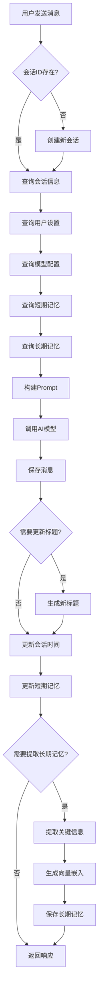

# KChat 持久化改造架构设计方案

---

## 文档信息

| 项目 | 说明 |
|------|------|
| **文档版本** | v1.0 |
| **创建日期** | 2026-05-27 |
| **适用版本** | KChat Backend v1.0 |
| **作者** | Architecture Team |

---

## 目录

1. [当前项目调用链分析](#一、当前项目调用链分析)
2. [需要持久化的数据识别](#二、需要持久化的数据识别)
3. [数据库表结构设计](#三、数据库表结构设计)
4. [代码修改分析](#四、代码修改分析)
5. [新模块结构设计](#五、新模块结构设计)
6. [数据流设计](#六、数据流设计)
7. [技术债识别与优先级](#七、技术债识别与优先级)
8. [实施计划](#八、实施计划)

---

## 一、当前项目调用链分析

### 1.1 项目技术栈

| 层 | 技术 | 说明 |
|----|------|------|
| 前端 | React + Vite | 前端应用框架 |
| 后端 | Spring Boot 3.2 | Java后端框架 |
| 语言 | Java 17 | 编程语言 |
| AI框架 | LangChain4j | AI应用开发框架 |
| 本地模型 | Ollama | 本地LLM运行时 |
| 数据库 | H2 (内存) | 当前数据库 |

### 1.2 完整调用链路图

```
┌─────────────────────────────────────────────────────────────────────────┐
│                            前端 (React + Vite)                          │
└─────────────────────────────────┬───────────────────────────────────────┘
                                  │ HTTP REST
                                  ▼
┌─────────────────────────────────────────────────────────────────────────┐
│                        Controller层                                    │
│  ChatController │ ModelConfigController │ ImageController              │
└─────────────────────────────────┬───────────────────────────────────────┘
                                  │ Service调用
                                  ▼
┌─────────────────────────────────────────────────────────────────────────┐
│                        Service层                                       │
│  ChatService │ StreamingService │ ConversationService                  │
│  MessagePersistenceService │ MemoryService │ ModelConfigService        │
└─────────────────────────────────┬───────────────────────────────────────┘
                                  │ Client调用
                                  ▼
┌─────────────────────────────────────────────────────────────────────────┐
│                        Client层                                        │
│           OllamaClient │ OpenAICompatibleClient                        │
└─────────────────────────────────┬───────────────────────────────────────┘
                                  │ 记忆管理
                                  ▼
┌─────────────────────────────────────────────────────────────────────────┐
│                        记忆层                                          │
│           ShortTermMemory │ LongTermMemory (空实现)                     │
└─────────────────────────────────┬───────────────────────────────────────┘
                                  │ Repository调用
                                  ▼
┌─────────────────────────────────────────────────────────────────────────┐
│                        数据库 (H2 Memory)                              │
│  ConversationRepository │ MessageRepository │ ModelConfigRepository    │
└─────────────────────────────────────────────────────────────────────────┘
```

### 1.3 调用链明细表

| 前端操作 | Controller | Service | Client | Repository |
|----------|------------|---------|--------|------------|
| 发送消息 | ChatController | ChatService | OllamaClient | MessageRepository |
| 流式消息 | ChatController | StreamingService | OllamaClient/OpenAICompatibleClient | MessageRepository |
| 创建会话 | ChatController | ConversationService | - | ConversationRepository |
| 会话列表 | ChatController | ConversationService | - | ConversationRepository |
| 模型配置 | ModelConfigController | ModelConfigService | - | ModelConfigRepository |

---

## 二、需要持久化的数据识别

### 2.1 数据分类总览

| 模块 | 数据项 | 用途 | 生命周期 | 建议存储 |
|------|--------|------|----------|----------|
| **会话状态** | 会话列表 | 用户对话历史 | 长期 | MySQL |
| | 聊天消息 | 消息内容记录 | 长期 | MySQL |
| | 会话元数据 | 标题、模型、时间戳 | 长期 | MySQL |
| | Token统计 | 消息Token消耗 | 长期 | MySQL |
| | 图片附件 | 消息中的图片 | 长期 | 对象存储 |
| **模型配置** | 自定义模型配置 | 第三方模型接入 | 长期 | MySQL |
| **用户配置** | 用户主题 | 界面主题设置 | 长期 | MySQL |
| | 默认模型 | 用户默认选择 | 长期 | MySQL |
| | 记忆配置 | 记忆开关、上下文大小 | 长期 | MySQL |
| **AI记忆** | 短期记忆 | 当前会话上下文 | 会话级 | Redis |
| | 长期记忆 | 跨会话知识 | 长期 | 向量数据库 |
| **系统配置** | 全局设置 | 系统级配置 | 长期 | MySQL |

### 2.2 数据生命周期分析

| 数据类型 | 生命周期 | 存储要求 | 访问频率 |
|----------|----------|----------|----------|
| 会话消息 | 长期（用户删除前） | 持久化、事务性 | 高 |
| 短期记忆 | 会话级别（会话结束后可清除） | 缓存、快速读写 | 极高 |
| 长期记忆 | 长期（跨会话） | 向量检索、持久化 | 中 |
| 用户设置 | 长期（用户修改前） | 持久化 | 低 |
| 模型配置 | 长期（用户删除前） | 持久化 | 低 |

---

## 三、数据库表结构设计

### 3.1 会话表 `conversation`

| 字段名 | 类型 | 约束 | 说明 |
|--------|------|------|------|
| `id` | VARCHAR(36) | PRIMARY KEY | 会话UUID |
| `user_id` | VARCHAR(36) | NOT NULL | 用户标识 |
| `title` | VARCHAR(255) | NOT NULL | 会话标题 |
| `model_id` | VARCHAR(255) | NOT NULL | 使用的模型ID |
| `token_usage` | INT | DEFAULT 0 | 累计Token消耗 |
| `create_time` | DATETIME | NOT NULL | 创建时间 |
| `update_time` | DATETIME | NOT NULL | 更新时间 |

**索引设计**：
- `idx_conversation_user_id` (user_id)
- `idx_conversation_update_time` (update_time)

### 3.2 消息表 `message`

| 字段名 | 类型 | 约束 | 说明 |
|--------|------|------|------|
| `id` | VARCHAR(36) | PRIMARY KEY | 消息UUID |
| `conversation_id` | VARCHAR(36) | FOREIGN KEY | 所属会话 |
| `role` | VARCHAR(20) | NOT NULL | 用户/助手/系统 |
| `content` | TEXT | NOT NULL | 消息内容 |
| `image_urls` | TEXT | NULL | 图片URL(JSON数组) |
| `token_count` | INT | DEFAULT 0 | 消息Token数 |
| `create_time` | DATETIME | NOT NULL | 创建时间 |

**索引设计**：
- `idx_message_conversation_id` (conversation_id)
- `idx_message_create_time` (create_time)

### 3.3 模型配置表 `model_config`

| 字段名 | 类型 | 约束 | 说明 |
|--------|------|------|------|
| `id` | VARCHAR(36) | PRIMARY KEY | 配置UUID |
| `name` | VARCHAR(100) | NOT NULL | 配置名称 |
| `provider` | VARCHAR(50) | NOT NULL | 提供商 |
| `base_url` | VARCHAR(500) | NULL | API基础地址 |
| `api_key` | VARCHAR(500) | NULL | API密钥(加密) |
| `model_name` | VARCHAR(100) | NOT NULL | 模型名称 |
| `stream` | BOOLEAN | DEFAULT TRUE | 是否流式 |
| `temperature` | DECIMAL(3,2) | DEFAULT 0.7 | 温度参数 |
| `max_tokens` | INT | DEFAULT 4096 | 最大Token数 |
| `enable` | BOOLEAN | DEFAULT TRUE | 是否启用 |
| `user_id` | VARCHAR(36) | NULL | 用户私有配置 |
| `create_time` | DATETIME | NOT NULL | 创建时间 |

**索引设计**：
- `idx_model_config_user_id` (user_id)
- `idx_model_config_enable` (enable)

### 3.4 用户设置表 `user_setting`

| 字段名 | 类型 | 约束 | 说明 |
|--------|------|------|------|
| `id` | VARCHAR(36) | PRIMARY KEY | 设置UUID |
| `user_id` | VARCHAR(36) | NOT NULL UNIQUE | 用户标识 |
| `theme` | VARCHAR(20) | DEFAULT 'light' | 主题 |
| `memory_enable` | BOOLEAN | DEFAULT TRUE | 记忆功能开关 |
| `default_model` | VARCHAR(255) | NULL | 默认模型ID |
| `context_size` | INT | DEFAULT 10 | 上下文消息数 |
| `auto_title` | BOOLEAN | DEFAULT TRUE | 自动生成标题 |
| `create_time` | DATETIME | NOT NULL | 创建时间 |
| `update_time` | DATETIME | NOT NULL | 更新时间 |

### 3.5 长期记忆表 `long_term_memory`

| 字段名 | 类型 | 约束 | 说明 |
|--------|------|------|------|
| `id` | VARCHAR(36) | PRIMARY KEY | 记忆UUID |
| `user_id` | VARCHAR(36) | NOT NULL | 用户标识 |
| `content` | TEXT | NOT NULL | 记忆内容 |
| `type` | VARCHAR(20) | NOT NULL | 类型 |
| `embedding` | TEXT | NULL | 向量嵌入(JSON) |
| `source_conversation_id` | VARCHAR(36) | NULL | 来源会话 |
| `create_time` | DATETIME | NOT NULL | 创建时间 |

**索引设计**：
- `idx_memory_user_id` (user_id)
- `idx_memory_type` (type)

---

## 四、代码修改分析

### 4.1 Controller层

| Controller | 修改内容 | 修改原因 | 状态 |
|------------|----------|----------|------|
| `ChatController` | 添加用户上下文获取 | 用户数据隔离 | 需要修改 |
| `ModelConfigController` | 添加用户私有配置支持 | 区分公共/私有配置 | 需要修改 |
| **新增** `UserSettingController` | 用户设置CRUD接口 | 管理用户偏好 | 需要新增 |

### 4.2 Service层

| Service | 修改内容 | 修改原因 | 状态 |
|---------|----------|----------|------|
| `ChatService` | 添加user_id参数 | 用户数据隔离 | 需要修改 |
| `StreamingService` | 添加user_id参数 | 用户数据隔离 | 需要修改 |
| `ConversationService` | 添加用户隔离查询 | 只能访问自己的会话 | 需要修改 |
| `MemoryService` | 实现长期记忆持久化 | 当前为空实现 | 需要修改 |
| **新增** `UserSettingService` | 用户设置管理 | 管理用户偏好 | 需要新增 |

### 4.3 Entity层

| Entity | 修改内容 | 修改原因 | 状态 |
|--------|----------|----------|------|
| `Conversation` | 添加user_id、token_usage | 用户隔离和统计 | 需要修改 |
| `Message` | 添加image_urls、token_count | 支持图片和统计 | 需要修改 |
| `ModelConfig` | 添加user_id字段 | 支持用户私有配置 | 需要修改 |
| **新增** `UserSetting` | 新建实体 | 用户设置持久化 | 需要新增 |
| **新增** `LongTermMemory` | 新建实体 | 长期记忆持久化 | 需要新增 |

### 4.4 Repository层

| Repository | 修改内容 | 修改原因 | 状态 |
|------------|----------|----------|------|
| `ConversationRepository` | 添加按用户查询方法 | 用户会话隔离 | 需要修改 |
| `MessageRepository` | 添加会话消息分页查询 | 支持分页 | 需要修改 |
| **新增** `UserSettingRepository` | 新建Repository | 用户设置访问 | 需要新增 |
| **新增** `LongTermMemoryRepository` | 新建Repository | 长期记忆访问 | 需要新增 |

### 4.5 DTO层

| DTO | 修改内容 | 修改原因 | 状态 |
|-----|----------|----------|------|
| `ChatRequest` | 添加user_id字段 | 标识请求来源用户 | 需要修改 |
| `ConversationDTO` | 添加token_usage字段 | 返回统计信息 | 需要修改 |
| `MessageDTO` | 添加image_urls、token_count | 返回完整信息 | 需要修改 |
| **新增** `UserSettingDTO` | 新建DTO | 用户设置传输 | 需要新增 |

### 4.6 配置类

| 配置类 | 修改内容 | 修改原因 | 状态 |
|--------|----------|----------|------|
| `application.yml` | 切换MySQL数据源 | 内存数据库不适合生产 | 需要修改 |
| **新增** `RedisConfig` | Redis配置 | 短期记忆缓存 | 需要新增 |
| **新增** `VectorDBConfig` | 向量数据库配置 | 长期记忆向量检索 | 需要新增 |

---

## 五、新模块结构设计

### 5.1 模块结构

```
backend/src/main/java/com/example/app/
├── client/                    # AI模型客户端
│   ├── OllamaClient.java
│   └── OpenAICompatibleClient.java
├── config/                    # 配置类
│   ├── AsyncConfig.java
│   ├── DataSourceConfig.java    # 新增：数据源配置
│   ├── RedisConfig.java         # 新增：Redis配置
│   ├── VectorDBConfig.java      # 新增：向量DB配置
│   └── WebConfig.java
├── controller/                # REST控制层
│   ├── ChatController.java
│   ├── ConversationController.java  # 新增：会话管理
│   ├── ModelConfigController.java
│   ├── UserSettingController.java   # 新增：用户设置
│   └── ImageController.java
├── service/                   # 业务逻辑层
│   ├── ChatService.java
│   ├── StreamingService.java
│   ├── ConversationService.java
│   ├── MessagePersistenceService.java
│   ├── MemoryService.java
│   ├── ModelConfigService.java
│   └── UserSettingService.java      # 新增
├── repository/                # 数据访问层
│   ├── ConversationRepository.java
│   ├── MessageRepository.java
│   ├── ModelConfigRepository.java
│   ├── UserSettingRepository.java   # 新增
│   └── LongTermMemoryRepository.java # 新增
├── entity/                    # JPA实体
│   ├── Conversation.java
│   ├── Message.java
│   ├── ModelConfig.java
│   ├── UserSetting.java             # 新增
│   └── LongTermMemory.java          # 新增
├── dto/                       # 数据传输对象
│   ├── request/                    # 新增：请求DTO
│   │   ├── ChatRequest.java
│   │   ├── UserSettingRequest.java
│   │   └── ModelConfigRequest.java
│   └── response/                   # 新增：响应DTO
│       ├── ChatResponse.java
│       ├── ConversationDTO.java
│       ├── MessageDTO.java
│       └── UserSettingDTO.java
├── memory/                    # 记忆管理
│   ├── ShortTermMemory.java   # 修改：Redis实现
│   └── LongTermMemory.java    # 修改：向量DB实现
├── prompt/                    # 新增：Prompt管理
│   └── PromptTemplate.java    # Prompt模板引擎
├── event/                     # 新增：事件驱动
│   ├── MessageCreatedEvent.java
│   ├── ConversationUpdatedEvent.java
│   └── EventPublisher.java
├── util/                      # 工具类
│   └── JsonUtils.java
└── Application.java
```

### 5.2 模块职责说明

| 模块 | 职责 | 核心类 |
|------|------|--------|
| **client** | 封装外部AI模型API调用 | OllamaClient, OpenAICompatibleClient |
| **config** | Spring配置类 | DataSourceConfig, RedisConfig, VectorDBConfig |
| **controller** | 处理HTTP请求，参数校验 | ChatController, UserSettingController |
| **service** | 核心业务逻辑，事务管理 | ChatService, StreamingService, MemoryService |
| **repository** | 数据库访问，JPA操作 | ConversationRepository, LongTermMemoryRepository |
| **entity** | JPA实体，映射数据库表 | Conversation, Message, UserSetting |
| **dto** | 请求/响应数据结构 | ChatRequest, ChatResponse, UserSettingDTO |
| **memory** | 对话记忆管理 | ShortTermMemory(Redis), LongTermMemory(向量DB) |
| **prompt** | Prompt模板管理和渲染 | PromptTemplate |
| **event** | 领域事件发布/订阅 | MessageCreatedEvent, EventPublisher |
| **util** | 通用工具类 | JsonUtils |

---

## 六、数据流设计

### 6.1 用户发送消息流程



### 6.2 数据读写矩阵

| 操作 | 会话表 | 消息表 | 模型配置 | 用户设置 | 短期记忆 | 长期记忆 |
|------|--------|--------|----------|----------|----------|----------|
| 发送消息 | 读/更新 | 写入 | 读取 | 读取 | 读/更新 | 读取 |
| 创建会话 | 写入 | - | 读取 | 读取 | - | - |
| 列表会话 | 读取 | - | - | - | - | - |
| 删除会话 | 删除 | 删除 | - | - | 删除 | - |
| 保存设置 | - | - | - | 写入 | - | - |
| 提取记忆 | - | 读取 | - | 读取 | - | 写入 |

### 6.3 数据流向图

```
用户操作                    数据库操作
   │                           │
   ▼                           ▼
┌─────────┐              ┌──────────────┐
│ 前端请求 │ ──────►      │  Controller  │
└─────────┘              └──────┬───────┘
                               │
                    ┌───────────┼───────────┐
                    ▼           ▼           ▼
              ┌──────────┐ ┌──────────┐ ┌──────────┐
              │ChatService│ │MemoryService│ │UserSettingService│
              └─────┬────┘ └─────┬────┘ └─────┬────┘
                    │           │           │
         ┌──────────┼───────────┴──────┬──────┘
         ▼          ▼                  ▼
    ┌────────┐ ┌──────────┐      ┌──────────┐
    │ Ollama │ │  Redis   │      │ VectorDB │
    │Client  │ │(短期记忆) │      │(长期记忆) │
    └────────┘ └──────────┘      └──────────┘
         │
         ▼
    ┌─────────────────────┐
    │    MySQL Database   │
    │ conversation/message│
    │ model_config/user_setting │
    └─────────────────────┘
```

---

## 七、技术债识别与优先级

### 7.1 P0 - 紧急（立即执行）

| 问题 | 改造成本 | 收益 | 风险 | 说明 |
|------|----------|------|------|------|
| 切换MySQL数据源 | 低 | 高 | 低 | 当前H2内存数据库导致数据丢失 |
| 添加用户隔离字段 | 低 | 高 | 低 | 支持多用户，数据隔离 |
| 修复LongTermMemory空实现 | 中 | 高 | 中 | 实现基本的长期记忆存储 |
| 添加用户设置管理 | 低 | 中 | 低 | 用户偏好持久化 |

### 7.2 P1 - 重要（1-2周）

| 问题 | 改造成本 | 收益 | 风险 | 说明 |
|------|----------|------|------|------|
| 引入Redis缓存短期记忆 | 中 | 中 | 中 | 提升性能，会话级缓存 |
| 添加向量数据库支持 | 高 | 高 | 高 | RAG能力，知识检索 |
| 实现Prompt模板引擎 | 中 | 中 | 低 | 统一Prompt管理 |
| 添加事件驱动架构 | 中 | 中 | 中 | 解耦业务逻辑 |

### 7.3 P2 - 改进（1-2月）

| 问题 | 改造成本 | 收益 | 风险 | 说明 |
|------|----------|------|------|------|
| 引入对象存储 | 中 | 中 | 低 | 图片持久化 |
| 实现Token统计 | 低 | 低 | 低 | 成本核算 |
| 添加API密钥加密 | 低 | 低 | 低 | 安全加固 |
| 引入分页查询 | 低 | 低 | 低 | 大数据量支持 |

---

## 八、实施计划

### 8.1 第一阶段：基础持久化（1-2天）

| 任务 | 描述 | 负责人 |
|------|------|--------|
| 切换MySQL数据源 | 修改application.yml配置 | 后端开发 |
| 更新实体字段 | 添加user_id等字段 | 后端开发 |
| 更新Repository | 添加用户隔离查询 | 后端开发 |
| 测试数据持久化 | 验证重启后数据不丢失 | 测试 |

### 8.2 第二阶段：用户设置与记忆（3-5天）

| 任务 | 描述 | 负责人 |
|------|------|--------|
| 新增UserSetting实体 | 创建用户设置表和实体 | 后端开发 |
| 新增UserSettingService | 用户设置业务逻辑 | 后端开发 |
| 新增UserSettingController | 用户设置API | 后端开发 |
| 实现LongTermMemory | 实现长期记忆存储 | 后端开发 |

### 8.3 第三阶段：性能优化（3-5天）

| 任务 | 描述 | 负责人 |
|------|------|--------|
| 引入Redis | 配置Redis缓存 | 后端开发 |
| 修改ShortTermMemory | 使用Redis实现 | 后端开发 |
| 引入向量数据库 | 配置向量数据库 | 后端开发 |
| 实现RAG检索 | 长期记忆检索功能 | 后端开发 |

### 8.4 第四阶段：完善与测试（2-3天）

| 任务 | 描述 | 负责人 |
|------|------|--------|
| 添加分页查询 | 会话和消息分页 | 后端开发 |
| API密钥加密 | 敏感信息加密存储 | 后端开发 |
| 集成测试 | 端到端测试 | 测试 |
| 性能测试 | 压力测试 | 测试 |

---

## 九、总结

### 9.1 当前状态评估

| 指标 | 当前状态 | 目标状态 |
|------|----------|----------|
| 数据持久化 | ❌ H2内存 | ✅ MySQL |
| 用户隔离 | ❌ 无用户ID | ✅ user_id字段 |
| 长期记忆 | ❌ 空实现 | ✅ 向量数据库 |
| 用户设置 | ❌ 无 | ✅ 完整CRUD |
| 短期记忆 | ✅ 内存Map | ✅ Redis |

### 9.2 改造收益

| 收益项 | 说明 |
|--------|------|
| 数据不丢失 | 刷新页面后数据保留 |
| 多用户支持 | 用户数据隔离 |
| 长期记忆 | 跨会话知识积累 |
| RAG能力 | 外部知识库检索 |
| 性能提升 | Redis缓存加速 |

### 9.3 风险提示

| 风险 | 应对措施 |
|------|----------|
| 数据迁移 | 编写数据迁移脚本 |
| 向量数据库部署 | 先使用轻量级向量DB |
| Redis依赖 | 添加健康检查 |
| 性能影响 | 添加缓存策略 |

---

**文档版本**: v1.0  
**最后更新**: 2026-05-27
